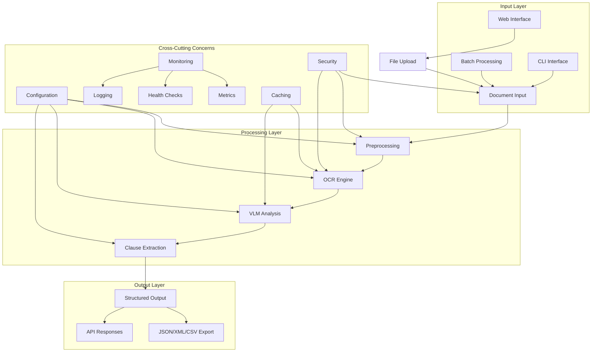
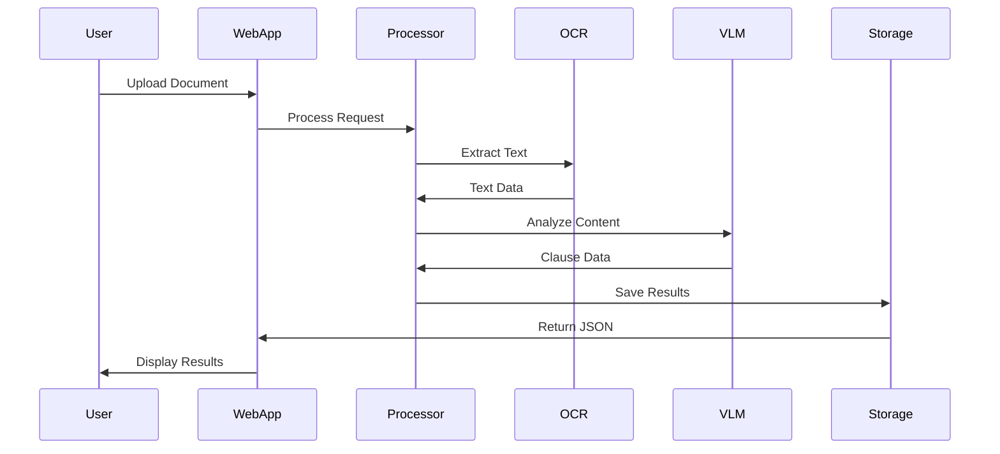
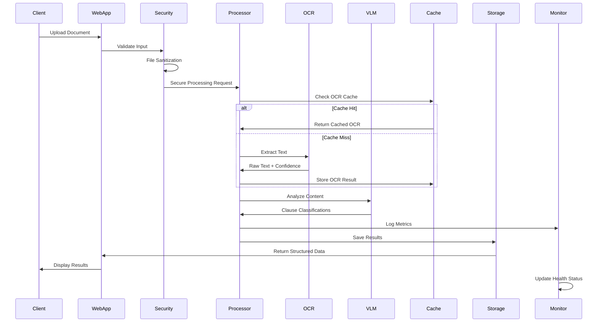
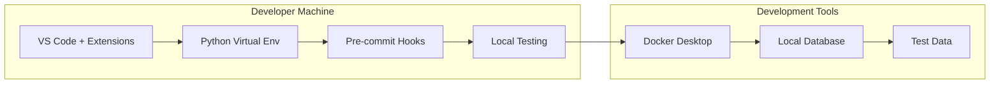
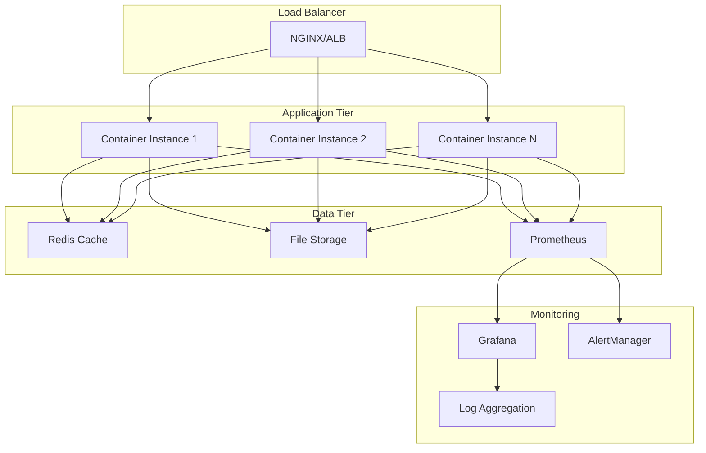

# Architecture Documentation

## System Overview

The Multimodal Contract Extractor is a Python-based application that processes legal documents using OCR and Vision-Language Models to extract structured clause information. The system follows a microservices-inspired architecture with clear separation of concerns, comprehensive observability, and robust security measures.

## High-Level Architecture

## Component Architecture

### Core Components

1. **Document Processing Pipeline**
   - Input validation and sanitization
   - Image preprocessing and enhancement
   - OCR text extraction
   - Vision-Language Model analysis
   - Clause detection and classification

2. **Configuration Management**
   - YAML-based configuration
   - Environment variable overrides
   - Runtime configuration validation

3. **Security Layer**
   - File validation and sanitization
   - Temporary file management
   - Input size limits
   - Error handling and cleanup

4. **Observability**
   - Prometheus metrics
   - Structured logging
   - Health check endpoints
   - Performance monitoring

### Data Flow

## Technology Stack

- **Language**: Python 3.8+
- **Web Framework**: Streamlit
- **OCR**: Tesseract
- **Image Processing**: Pillow, pdf2image
- **Configuration**: YAML, Environment Variables
- **Testing**: pytest
- **Linting**: ruff, bandit
- **Type Checking**: mypy
- **Containerization**: Docker
- **Monitoring**: Prometheus, Grafana
- **CI/CD**: GitHub Actions

## Deployment Architecture

### Local Development
- Virtual environment with dev dependencies
- Pre-commit hooks for code quality
- Local Streamlit server

### Container Deployment
- Multi-stage Docker build
- Non-root user security
- Health checks
- Resource limits

### Production Deployment
- Container orchestration (Docker Compose/Kubernetes)
- Load balancing
- Persistent storage for results
- Monitoring and alerting
- Backup and recovery

## Security Considerations

1. **Input Validation**
   - File type restrictions
   - Size limits
   - Path sanitization

2. **Runtime Security**
   - Non-root container execution
   - Temporary file cleanup
   - Error boundary handling

3. **Data Protection**
   - No persistent storage of documents
   - Secure temporary file handling
   - Configurable retention policies

## Performance Considerations

1. **Scalability**
   - Batch processing support
   - Configurable chunk sizes
   - Memory-efficient streaming

2. **Optimization**
   - OCR result caching
   - Parallel processing
   - Resource monitoring

## System Components Detail

### 1. Input Layer Components

#### Web Interface (`web_app.py`)
- **Technology**: Streamlit framework
- **Responsibilities**: File upload, user interaction, result visualization
- **Security**: File validation, size limits, temporary file management
- **Features**: Real-time processing feedback, result export options

#### CLI Interface (`extract.py`, `batch_extract.py`)
- **Technology**: Python CLI with argparse
- **Responsibilities**: Batch processing, automation workflows
- **Features**: Progress tracking, error handling, configurable output formats

### 2. Processing Layer Components

#### Document Preprocessing
- **Technology**: Pillow, pdf2image
- **Responsibilities**: Format conversion, image enhancement, validation
- **Optimizations**: Memory-efficient streaming, parallel processing
- **Caching**: Preprocessed document caching for repeated processing

#### OCR Engine
- **Technology**: Tesseract OCR
- **Responsibilities**: Text extraction from images and PDFs
- **Features**: Multi-language support, confidence scoring, region detection
- **Performance**: Result caching, batch processing optimization

#### Vision-Language Model Analysis
- **Technology**: Transformers, PyTorch (optional GPU support)
- **Responsibilities**: Semantic understanding, clause classification
- **Features**: Context-aware analysis, confidence scoring, custom model support

### 3. Output Layer Components

#### Structured Output Generator
- **Formats**: JSON, XML, CSV
- **Validation**: Schema validation, data integrity checks
- **Features**: Customizable output templates, metadata inclusion

### 4. Cross-Cutting Concerns

#### Configuration Management
- **Technology**: YAML configuration files, environment variables
- **Features**: Runtime reconfiguration, validation, defaults
- **Security**: Sensitive data handling, encryption support

#### Security Framework
- **Features**: Input validation, file sanitization, access control
- **Compliance**: GDPR, SOC 2 ready architecture
- **Monitoring**: Security event logging, threat detection

#### Observability Stack
- **Monitoring**: Prometheus metrics, Grafana dashboards
- **Logging**: Structured logging with correlation IDs
- **Health Checks**: Comprehensive system health monitoring
- **Alerting**: Configurable alerting rules and notifications

## Data Flow Architecture

## Deployment Architecture

### Development Environment

### Production Environment

## Performance Architecture

### Scalability Patterns
1. **Horizontal Scaling**: Container-based auto-scaling
2. **Caching Strategy**: Multi-level caching (OCR results, processed documents)
3. **Async Processing**: Background job processing for large documents
4. **Resource Optimization**: Memory-efficient streaming for large files

### Performance Metrics
- **Throughput**: Documents processed per minute
- **Latency**: End-to-end processing time
- **Resource Usage**: CPU, memory, storage utilization
- **Error Rates**: Processing failures and retry patterns

## Security Architecture

### Security Layers
1. **Input Validation**: File type, size, content validation
2. **Runtime Security**: Container security, non-root execution
3. **Data Protection**: Encryption at rest and in transit
4. **Access Control**: Authentication and authorization
5. **Audit Logging**: Comprehensive security event logging

### Compliance Framework
- **Data Privacy**: GDPR compliance patterns
- **Security Standards**: SOC 2 Type II controls
- **Industry Standards**: NIST Cybersecurity Framework alignment

## Technology Decision Matrix

| Component | Technology | Rationale | Alternatives Considered |
|-----------|------------|-----------|------------------------|
| Web Framework | Streamlit | Rapid prototyping, built-in UI components | Flask, FastAPI, Django |
| OCR Engine | Tesseract | Open source, multi-language support | AWS Textract, Google Vision API |
| Container Runtime | Docker | Industry standard, ecosystem support | Podman, containerd |
| Monitoring | Prometheus/Grafana | Open source, extensive ecosystem | DataDog, New Relic |
| CI/CD | GitHub Actions | Integrated with repository, free tier | Jenkins, GitLab CI, CircleCI |

## Future Enhancements

### Short-term (6 months)
1. **API Development**
   - REST API endpoints with OpenAPI documentation
   - Rate limiting and authentication
   - Webhook integration for external systems

2. **Performance Optimization**
   - GPU acceleration for VLM processing
   - Advanced caching strategies
   - Parallel document processing

### Medium-term (12 months)
1. **ML Integration**
   - Custom model training pipeline
   - Transfer learning capabilities
   - A/B testing framework for model versions

2. **Advanced Features**
   - Real-time collaboration tools
   - Advanced analytics and reporting
   - Multi-tenant architecture

### Long-term (18+ months)
1. **Enterprise Features**
   - Advanced security and compliance tools
   - Custom deployment options
   - Integration marketplace