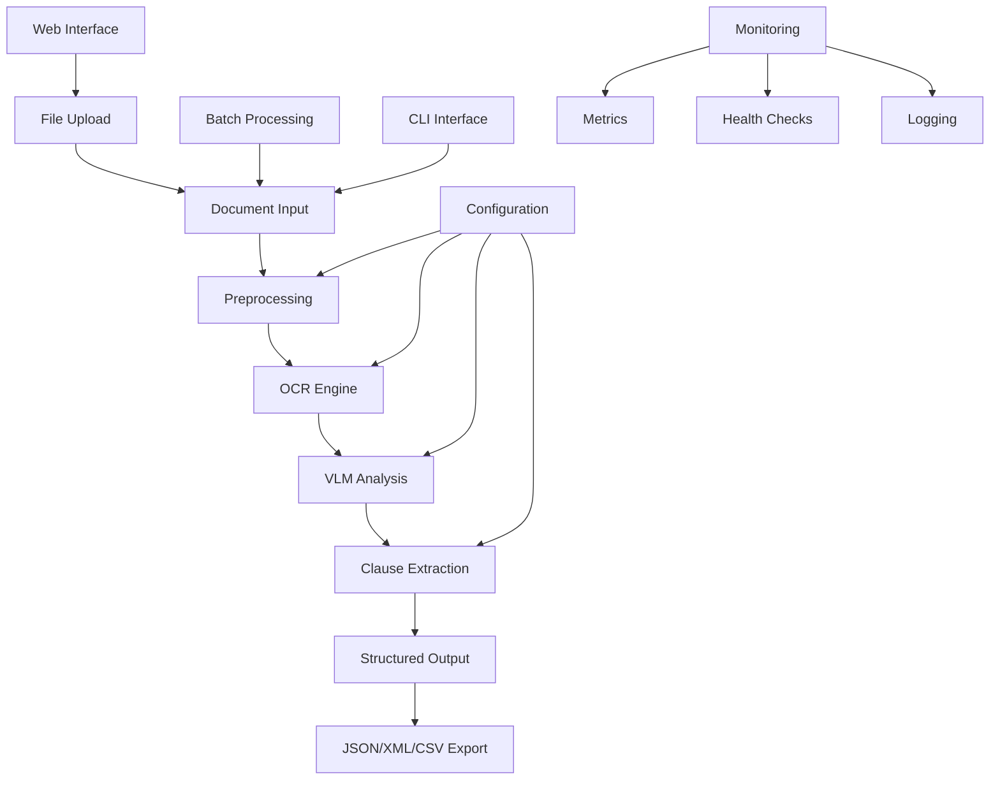
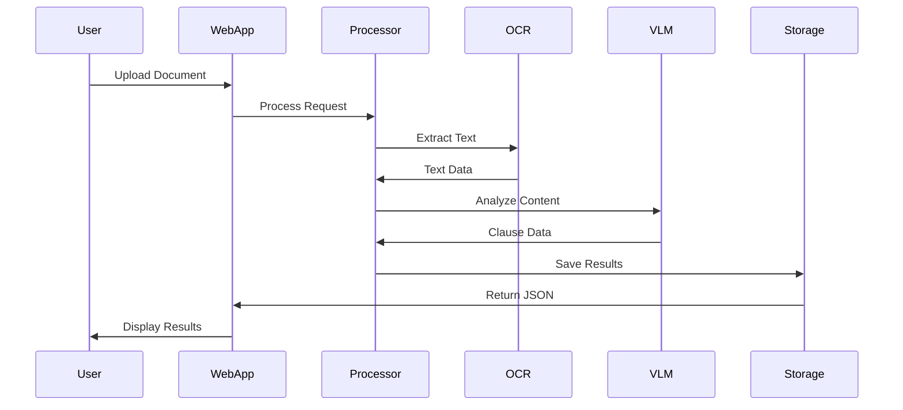

# Architecture Documentation

## System Overview

The Multimodal Contract Extractor is a Python-based application that processes legal documents using OCR and Vision-Language Models to extract structured clause information.

## High-Level Architecture

## Component Architecture

### Core Components

1. **Document Processing Pipeline**
   - Input validation and sanitization
   - Image preprocessing and enhancement
   - OCR text extraction
   - Vision-Language Model analysis
   - Clause detection and classification

2. **Configuration Management**
   - YAML-based configuration
   - Environment variable overrides
   - Runtime configuration validation

3. **Security Layer**
   - File validation and sanitization
   - Temporary file management
   - Input size limits
   - Error handling and cleanup

4. **Observability**
   - Prometheus metrics
   - Structured logging
   - Health check endpoints
   - Performance monitoring

### Data Flow

## Technology Stack

- **Language**: Python 3.8+
- **Web Framework**: Streamlit
- **OCR**: Tesseract
- **Image Processing**: Pillow, pdf2image
- **Configuration**: YAML, Environment Variables
- **Testing**: pytest
- **Linting**: ruff, bandit
- **Type Checking**: mypy
- **Containerization**: Docker
- **Monitoring**: Prometheus, Grafana
- **CI/CD**: GitHub Actions

## Deployment Architecture

### Local Development
- Virtual environment with dev dependencies
- Pre-commit hooks for code quality
- Local Streamlit server

### Container Deployment
- Multi-stage Docker build
- Non-root user security
- Health checks
- Resource limits

### Production Deployment
- Container orchestration (Docker Compose/Kubernetes)
- Load balancing
- Persistent storage for results
- Monitoring and alerting
- Backup and recovery

## Security Considerations

1. **Input Validation**
   - File type restrictions
   - Size limits
   - Path sanitization

2. **Runtime Security**
   - Non-root container execution
   - Temporary file cleanup
   - Error boundary handling

3. **Data Protection**
   - No persistent storage of documents
   - Secure temporary file handling
   - Configurable retention policies

## Performance Considerations

1. **Scalability**
   - Batch processing support
   - Configurable chunk sizes
   - Memory-efficient streaming

2. **Optimization**
   - OCR result caching
   - Parallel processing
   - Resource monitoring

## Future Enhancements

1. **ML Integration**
   - Custom model training
   - Transfer learning
   - Multi-language support

2. **API Development**
   - REST API endpoints
   - GraphQL interface
   - Webhook integration

3. **Advanced Features**
   - Real-time processing
   - Collaborative review
   - Advanced analytics