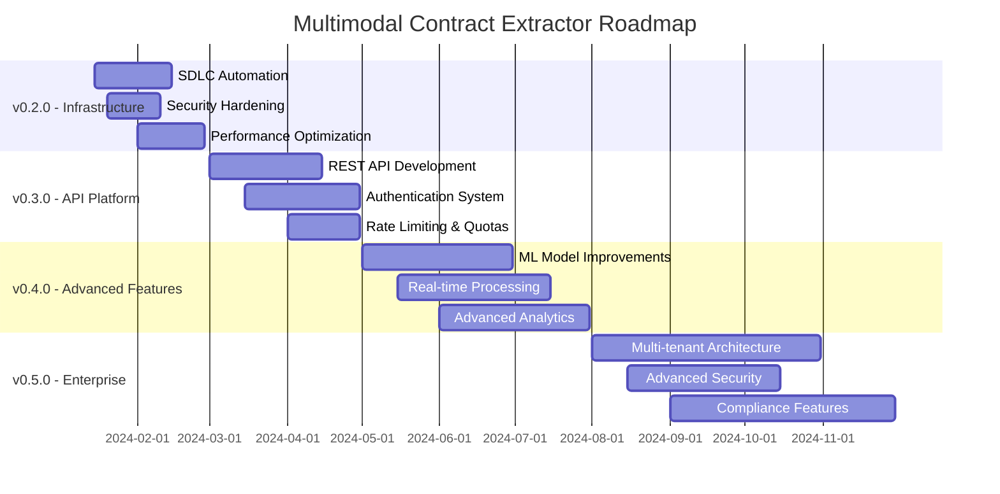

# Project Roadmap

## Vision Statement
Transform the multimodal contract extractor into a production-ready, enterprise-grade document processing platform that enables organizations to efficiently extract, analyze, and manage legal contract information at scale.

## Current Status (v0.1.0)
- ✅ Core OCR and document processing capabilities
- ✅ Streamlit web interface for basic document upload and processing
- ✅ CLI tools for batch processing
- ✅ Basic monitoring and health checks
- ✅ Foundational security measures
- ✅ Comprehensive test suite and CI/CD pipeline

## Roadmap Overview

---

# Version 0.2.0 - Infrastructure & Platform (Q1 2024)
**Release Target: February 28, 2024**

## Theme: Production-Ready Infrastructure
Focus on creating a robust, scalable, and maintainable platform foundation.

### 🎯 Key Objectives
- Implement comprehensive SDLC automation
- Enhance security posture and compliance readiness
- Optimize performance and scalability
- Establish monitoring and observability excellence

### 📋 Feature Deliverables

#### Infrastructure & DevOps
- **Complete SDLC Automation Pipeline**
  - Advanced GitHub Actions workflows with matrix testing
  - Automated security scanning (CodeQL, Snyk, Trivy)
  - Comprehensive deployment automation with rollback capabilities
  - Environment management (dev, staging, production)
  
- **Enhanced Container Strategy**
  - Multi-stage Docker builds with security hardening
  - Multi-platform support (AMD64, ARM64)
  - Optimized image sizes and build times
  - Container registry integration with signing
  
- **Comprehensive Documentation**
  - API documentation with OpenAPI/Swagger
  - Developer onboarding guides
  - Operational runbooks
  - Architecture decision records (ADRs)

#### Security & Compliance
- **Security Hardening**
  - Comprehensive vulnerability scanning
  - Secrets management and rotation
  - Container security policies
  - Branch protection and signed commits
  
- **Compliance Framework**
  - GDPR compliance documentation
  - SOC 2 Type II preparation
  - Security audit trails
  - Data retention policies

#### Performance & Monitoring
- **Advanced Monitoring**
  - Prometheus metrics with custom dashboards
  - Distributed tracing with correlation IDs
  - Performance benchmarking and alerting
  - SLA monitoring and reporting
  
- **Performance Optimization**
  - OCR result caching with Redis
  - Parallel processing for batch operations
  - Memory optimization for large documents
  - GPU acceleration support (optional)

### 🎯 Success Metrics
- **Deployment Frequency**: Daily deployments with zero downtime
- **Build Success Rate**: >99% CI/CD pipeline success rate
- **Security Posture**: Zero high-severity vulnerabilities
- **Performance**: <5 second processing time for typical documents
- **Reliability**: 99.9% uptime SLA achievement

### 🛠️ Technical Debt Paydown
- Comprehensive type hints with MyPy enforcement
- Code coverage improvement to >90%
- Legacy code refactoring and documentation
- Dependency updates and security patches

---

# Version 0.3.0 - API Platform & Integration (Q2 2024)
**Release Target: April 30, 2024**

## Theme: API-First Platform
Transform into a comprehensive API platform with enterprise integration capabilities.

### 🎯 Key Objectives
- Develop robust REST API with comprehensive documentation
- Implement enterprise-grade authentication and authorization
- Enable third-party integrations and webhooks
- Establish rate limiting and quota management

### 📋 Feature Deliverables

#### REST API Platform
- **Core API Endpoints**
  - Document upload and processing endpoints
  - Batch processing job management
  - Results retrieval and export APIs
  - System status and health check APIs
  
- **API Documentation & Tooling**
  - OpenAPI 3.0 specification
  - Interactive Swagger UI
  - Postman collections and SDKs
  - API versioning strategy
  
- **Developer Experience**
  - Comprehensive API documentation
  - Code examples in multiple languages
  - SDKs for Python, JavaScript, and Go
  - Sandbox environment for testing

#### Authentication & Authorization
- **Authentication System**
  - JWT-based authentication
  - API key management
  - OAuth 2.0 integration
  - Multi-factor authentication (MFA)
  
- **Authorization Framework**
  - Role-based access control (RBAC)
  - Fine-grained permissions
  - Resource-level access control
  - Audit logging for all access

#### Integration Capabilities
- **Webhook System**
  - Configurable event notifications
  - Retry logic and failure handling
  - Webhook signature verification
  - Real-time processing updates
  
- **Third-party Integrations**
  - Cloud storage providers (AWS S3, Google Cloud, Azure)
  - Document management systems integration
  - CRM and ERP system connectors
  - Notification services (Slack, email, SMS)

#### Performance & Scalability
- **Rate Limiting & Quotas**
  - Configurable rate limits per API key
  - Usage quotas and billing integration
  - Fair usage policies
  - Abuse detection and prevention
  
- **Caching Strategy**
  - API response caching
  - CDN integration for static assets
  - Cache invalidation strategies
  - Performance optimization

### 🎯 Success Metrics
- **API Adoption**: 100+ registered API users
- **API Reliability**: 99.95% API uptime
- **Response Times**: <200ms median API response time
- **Integration Success**: 10+ successful third-party integrations
- **Developer Satisfaction**: >4.5/5 developer experience rating

### 🚀 Innovation Highlights
- GraphQL API for flexible data querying
- Real-time WebSocket connections for live updates
- API analytics and usage insights
- Self-service developer portal

---

# Version 0.4.0 - Advanced ML & Real-time (Q3 2024)
**Release Target: July 31, 2024**

## Theme: Intelligent Processing & Real-time Capabilities
Enhanced ML capabilities with real-time processing and advanced analytics.

### 🎯 Key Objectives
- Implement advanced ML models for improved accuracy
- Enable real-time document processing capabilities
- Develop comprehensive analytics and reporting
- Introduce AI-powered insights and recommendations

### 📋 Feature Deliverables

#### Advanced ML Capabilities
- **Custom Model Training**
  - Domain-specific model fine-tuning
  - Transfer learning capabilities
  - A/B testing framework for model versions
  - Continuous learning from user feedback
  
- **Enhanced Accuracy**
  - Multi-model ensemble approaches
  - Confidence calibration and uncertainty quantification
  - Specialized models for different contract types
  - Advanced preprocessing and augmentation

#### Real-time Processing
- **Streaming Architecture**
  - Real-time document processing pipeline
  - WebSocket-based live updates
  - Progressive result delivery
  - Concurrent processing capabilities
  
- **Live Collaboration**
  - Real-time annotation and review
  - Collaborative editing capabilities
  - Live comments and feedback
  - Version control for document changes

#### Analytics & Insights
- **Advanced Analytics**
  - Processing performance analytics
  - Accuracy and confidence trend analysis
  - Contract type and clause distribution insights
  - Custom reporting and dashboards
  
- **AI-Powered Insights**
  - Anomaly detection in contract terms
  - Risk assessment and scoring
  - Comparative analysis across documents
  - Predictive analytics for processing outcomes

#### Performance Optimization
- **GPU Acceleration**
  - CUDA support for ML model inference
  - Optimized memory usage for large models
  - Batch processing optimization
  - Dynamic scaling based on load
  
- **Caching & Optimization**
  - Intelligent result caching
  - Preprocessing optimization
  - Model serving optimization
  - Resource usage optimization

### 🎯 Success Metrics
- **Processing Speed**: 50% improvement in processing time
- **Accuracy**: 95%+ clause detection accuracy
- **Real-time Performance**: <1 second real-time response
- **User Engagement**: 3x increase in daily active users
- **AI Insights Adoption**: 70% of users using AI recommendations

### 🚀 Innovation Highlights
- Computer vision models for layout understanding
- Natural language processing for semantic analysis
- Federated learning for privacy-preserving model updates
- Edge computing support for on-premises deployment

---

# Version 0.5.0 - Enterprise & Compliance (Q4 2024)
**Release Target: November 30, 2024**

## Theme: Enterprise-Grade Platform
Full enterprise readiness with advanced security, compliance, and multi-tenancy.

### 🎯 Key Objectives
- Implement multi-tenant architecture for enterprise clients
- Achieve comprehensive compliance certifications
- Develop advanced security and privacy features
- Enable enterprise deployment and customization options

### 📋 Feature Deliverables

#### Multi-tenant Architecture
- **Tenant Management**
  - Isolated tenant environments
  - Custom branding and configuration
  - Tenant-specific feature flags
  - Billing and usage tracking per tenant
  
- **Resource Isolation**
  - Database multi-tenancy
  - Storage isolation and encryption
  - Network segmentation
  - Performance isolation

#### Advanced Security
- **Enterprise Security**
  - Advanced threat detection
  - Security incident response automation
  - Penetration testing and vulnerability management
  - Security compliance monitoring
  
- **Privacy Protection**
  - Advanced data anonymization
  - Privacy-preserving analytics
  - Data residency controls
  - Right to be forgotten implementation

#### Compliance & Governance
- **Regulatory Compliance**
  - SOC 2 Type II certification
  - GDPR full compliance
  - HIPAA compliance for healthcare
  - ISO 27001 certification preparation
  
- **Governance Features**
  - Advanced audit trails and reporting
  - Data governance policies
  - Compliance monitoring dashboards
  - Automated compliance reporting

#### Enterprise Features
- **Advanced Administration**
  - Comprehensive admin panel
  - User and role management
  - System configuration management
  - Enterprise integration tools
  
- **Custom Deployment**
  - On-premises deployment options
  - Hybrid cloud configurations
  - Air-gapped environment support
  - Custom infrastructure templates

### 🎯 Success Metrics
- **Enterprise Clients**: 5+ enterprise customers onboarded
- **Compliance**: 100% compliance audit success
- **Security**: Zero security incidents
- **Multi-tenancy**: Support for 100+ concurrent tenants
- **Enterprise Satisfaction**: >4.8/5 enterprise customer satisfaction

### 🚀 Innovation Highlights
- Zero-trust security architecture
- Blockchain-based audit trails
- Advanced encryption and key management
- AI-powered compliance monitoring

---

# Version 1.0.0 - Production Release (Q1 2025)
**Release Target: March 31, 2025**

## Theme: Production Excellence
Comprehensive production-ready platform with full feature completeness.

### 🎯 Key Objectives
- Achieve production-grade stability and performance
- Complete feature set for all target use cases
- Comprehensive ecosystem and marketplace
- Global scalability and localization

### 📋 Feature Deliverables

#### Production Readiness
- **High Availability**
  - Multi-region deployment
  - Disaster recovery capabilities
  - Auto-scaling and load balancing
  - 99.99% uptime SLA
  
- **Global Scale**
  - CDN integration for global performance
  - Multi-language support
  - Regional data compliance
  - Global customer support

#### Complete Feature Set
- **Advanced Processing**
  - Support for 50+ document types
  - 99%+ accuracy across all contract types
  - Sub-second processing for standard documents
  - Advanced layout and structure understanding
  
- **Ecosystem Integration**
  - 100+ third-party integrations
  - Marketplace for custom plugins
  - API ecosystem for developers
  - Partner integration program

#### Enterprise Excellence
- **Advanced Analytics**
  - Business intelligence dashboards
  - Predictive analytics and forecasting
  - Custom reporting and insights
  - Data export and integration capabilities
  
- **Premium Support**
  - 24/7 enterprise support
  - Dedicated customer success managers
  - Professional services and consulting
  - Training and certification programs

### 🎯 Success Metrics
- **Production Stability**: 99.99% uptime achievement
- **Global Reach**: Available in 20+ regions
- **Market Adoption**: 10,000+ active users
- **Enterprise Success**: 50+ enterprise customers
- **Ecosystem Growth**: 500+ developers using APIs

---

# Future Roadmap (2025+)

## Emerging Technologies
- **AI/ML Innovations**
  - Large Language Model integration
  - Multimodal AI for document understanding
  - Automated contract generation
  - Intelligent contract negotiation assistance

## Market Expansion
- **Industry Specialization**
  - Legal tech marketplace integration
  - Healthcare document processing
  - Financial services compliance
  - Real estate transaction automation

## Platform Evolution
- **Next-Generation Architecture**
  - Serverless and edge computing
  - Microservices architecture
  - Event-driven processing
  - Cloud-native optimization

---

# Success Metrics Dashboard

## Overall Platform Health
- **Reliability**: >99.9% uptime across all services
- **Performance**: <5 second average processing time
- **Security**: Zero high-severity vulnerabilities
- **Compliance**: 100% audit success rate

## Business Metrics
- **User Growth**: 50% quarter-over-quarter growth
- **Revenue**: $1M+ ARR by end of 2024
- **Customer Satisfaction**: >4.5/5 average rating
- **Market Share**: Top 3 in contract extraction tools

## Technical Excellence
- **Code Quality**: >90% test coverage, zero critical bugs
- **Documentation**: 100% API coverage, <24h issue resolution
- **Innovation**: 2+ major features per quarter
- **Team Productivity**: 20% improvement in development velocity

---

# Risk Management

## Technical Risks
- **Scalability Challenges**: Mitigation through cloud-native architecture
- **Security Vulnerabilities**: Continuous security scanning and auditing
- **Performance Degradation**: Comprehensive monitoring and optimization
- **Data Loss**: Robust backup and disaster recovery procedures

## Business Risks
- **Market Competition**: Continuous innovation and differentiation
- **Regulatory Changes**: Proactive compliance monitoring
- **Customer Churn**: Focus on customer success and value delivery
- **Technology Obsolescence**: Regular technology stack evaluation

## Operational Risks
- **Team Scaling**: Structured hiring and onboarding processes
- **Knowledge Management**: Comprehensive documentation and training
- **Process Maturity**: Continuous process improvement and automation
- **Vendor Dependencies**: Diversified vendor strategy and contingency planning

---

*This roadmap is a living document and will be updated quarterly based on market feedback, technical discoveries, and business priorities. All dates are target dates and subject to change based on development progress and external factors.*