# Technical Documentation
## Advanced Multimodal Contract Extractor System

**Version**: 4.0.0  
**Last Updated**: 2025-01-24  
**Authors**: Research & Development Team  

---

## 📋 Table of Contents

1. [Architecture Overview](#architecture-overview)
2. [System Components](#system-components)
3. [Novel Research Algorithms](#novel-research-algorithms)
4. [Enterprise Reliability](#enterprise-reliability)
5. [Generation 4 Optimization](#generation-4-optimization)
6. [API Documentation](#api-documentation)
7. [Algorithm Documentation](#algorithm-documentation)
8. [Configuration Guide](#configuration-guide)
9. [Integration Guide](#integration-guide)

---

## 🏗️ Architecture Overview

### System Architecture

The Advanced Multimodal Contract Extractor is built using a modular, distributed architecture designed for enterprise-scale deployment with advanced research capabilities:

```mermaid
graph TB
    subgraph "Client Layer"
        WebUI[Web Interface]
        RestAPI[REST API]
        CLI[Command Line Interface]
    end
    
    subgraph "Processing Layer"
        LB[Load Balancer]
        GW[API Gateway]
        Auth[Authentication Service]
    end
    
    subgraph "Core Services"
        DocProc[Document Processing Service]
        ContractExt[Contract Extraction Service]
        ValidationSvc[Validation Service]
        ResearchSvc[Research Service]
    end
    
    subgraph "Research Algorithms"
        GNN[Graph Neural Networks]
        TransAttn[Advanced Transformer Attention]
        FedLearn[Federated Learning]
        CausalInf[Causal Inference]
        MultiModal[Multimodal Fusion]
    end
    
    subgraph "Enterprise Systems"
        ErrorHand[Error Handling]
        Monitor[Monitoring & Observability]
        Security[Security & Compliance]
        Health[Health Checks]
        Logging[Logging & Analytics]
    end
    
    subgraph "Generation 4 Optimization"
        GPUOpt[GPU Tensor Optimization]
        DistComp[Distributed Computing]
        IntelCache[Intelligent Caching]
        AutoScale[Predictive Auto-Scaling]
        PerfMon[Performance Monitoring]
        ContOrch[Container Orchestration]
    end
    
    subgraph "Data Layer"
        Cache[(Multi-Level Cache)]
        DB[(Database)]
        Storage[(Object Storage)]
        ModelStore[(Model Repository)]
    end
    
    WebUI --> GW
    RestAPI --> GW
    CLI --> GW
    GW --> LB
    LB --> Auth
    Auth --> DocProc
    Auth --> ContractExt
    Auth --> ValidationSvc
    Auth --> ResearchSvc
    
    DocProc --> GNN
    DocProc --> TransAttn
    ContractExt --> MultiModal
    ResearchSvc --> FedLearn
    ResearchSvc --> CausalInf
    
    DocProc --> GPUOpt
    ContractExt --> DistComp
    ValidationSvc --> IntelCache
    
    DocProc --> ErrorHand
    ContractExt --> Monitor
    ValidationSvc --> Security
    ResearchSvc --> Health
    
    DocProc --> Cache
    ContractExt --> DB
    ValidationSvc --> Storage
    ResearchSvc --> ModelStore
```



### Key Design Principles

1. **Modularity**: Each component is independently deployable and scalable
2. **Research-First**: Novel algorithms integrated as first-class citizens
3. **Enterprise-Ready**: Built-in reliability, security, and monitoring
4. **Performance-Optimized**: Generation 4 optimizations for scale
5. **Multi-Modal**: Native support for diverse document types
6. **Privacy-Preserving**: Federated learning with differential privacy
7. **Cloud-Native**: Kubernetes-ready with multi-cloud support

---

## 🧩 System Components

### Core Processing Components

#### Document Processing Service
- **Purpose**: Primary document ingestion and preprocessing
- **Location**: `/src/multimodal_contract_extractor/document.py`
- **Key Features**:
  - Multi-format document loading (PDF, images, handwritten text)
  - OCR with confidence scoring
  - Document structure analysis
  - Metadata extraction

#### Contract Extraction Service
- **Purpose**: Core contract clause extraction and analysis
- **Location**: `/src/multimodal_contract_extractor/extraction.py`
- **Key Features**:
  - Advanced clause detection algorithms
  - Legal entity recognition
  - Contract relationship mapping
  - Multi-jurisdictional support

#### Validation Service
- **Purpose**: Data validation and quality assurance
- **Location**: `/src/services/validation_service.py`
- **Key Features**:
  - Comprehensive validation rules
  - Confidence scoring
  - Error detection and correction
  - Audit trail generation

### API Services

#### REST API
- **Purpose**: Primary programmatic interface
- **Location**: `/src/api/app.py`
- **Endpoints**:
  - `/api/v1/extract` - Document extraction
  - `/api/v1/validate` - Validation services
  - `/api/v1/research` - Research operations
  - `/api/v1/health` - Health monitoring
  - `/api/v1/metrics` - Performance metrics

#### Web Interface
- **Purpose**: Interactive user interface
- **Location**: `/web_app.py`, `/enhanced_web_app.py`
- **Features**:
  - Drag-and-drop document upload
  - Real-time processing status
  - Interactive result visualization
  - Export capabilities

---

## 🔬 Novel Research Algorithms

### Graph Neural Networks (GNN)

**Implementation**: `/src/multimodal_contract_extractor/graph_neural_networks.py`

#### Core Components

1. **Legal Entity Graph Construction**
   ```python
   # Example usage
   from multimodal_contract_extractor.graph_neural_networks import LegalGraphBuilder, create_legal_gnn_framework
   
   # Create framework
   framework = create_legal_gnn_framework()
   
   # Analyze contract
   results = await framework.analyze_contract_graph(document_text, clauses)
   ```

2. **Temporal Graph Neural Networks**
   - Tracks contract evolution over time
   - Models temporal dependencies
   - Enables version comparison

3. **Heterogeneous Graph Attention**
   - Multi-type legal entity processing
   - Cross-entity relationship modeling
   - Domain-specific attention mechanisms

#### Performance Targets
- **Accuracy**: >15% improvement over BERT baselines
- **Processing Speed**: <2 seconds for 50-page contracts
- **Memory Efficiency**: 40% reduction in memory usage

### Advanced Transformer Attention

**Implementation**: `/src/multimodal_contract_extractor/advanced_transformer_attention.py`

#### Specialized Attention Mechanisms

1. **Jurisdictional Attention**
   ```python
   # Configure jurisdictional context
   attention_config = {
       'jurisdiction': JurisdictionType.COMMON_LAW,
       'legal_domain': 'contract_law'
   }
   
   # Process with jurisdictional awareness
   results = await legal_transformer.process_legal_document(tokens, attention_config)
   ```

2. **Hierarchical Legal Attention**
   - Multi-level document hierarchy processing
   - Cross-level semantic relationships
   - Legal structure awareness

3. **Temporal Legal Attention**
   - Contract evolution tracking
   - Amendment analysis
   - Time-sensitive legal reasoning

#### Performance Targets
- **Legal Clause Classification**: >20% improvement over standard BERT
- **Cross-Jurisdictional Accuracy**: >85% consistency
- **Processing Throughput**: 1000+ documents/hour

### Federated Learning System

**Implementation**: `/src/multimodal_contract_extractor/federated_legal_learning.py`

#### Privacy-Preserving Legal AI

1. **Differential Privacy**
   ```python
   # Configure privacy mechanism
   privacy_config = {
       'epsilon': 1.0,  # Privacy budget
       'delta': 1e-5,   # Failure probability
       'mechanism': 'gaussian_noise'
   }
   
   # Create federated system
   fed_system = create_federated_legal_system()
   await fed_system.initialize_global_model(model_architecture)
   ```

2. **Multi-Jurisdictional Learning**
   - Compliant data sharing across regions
   - Jurisdiction-specific model personalization
   - Legal compliance verification

3. **Byzantine-Robust Aggregation**
   - Malicious client detection
   - Secure model aggregation
   - Trust scoring mechanisms

#### Performance Targets
- **Privacy Preservation**: ε-differential privacy with ε < 2.0
- **Utility Retention**: >90% model accuracy preservation
- **Collaboration Scale**: Support for 50+ organizations

### Causal Inference Engine

**Implementation**: `/src/multimodal_contract_extractor/causal_inference_legal.py`

#### Legal Causality Analysis

1. **Causal Graph Construction**
   - Legal cause-effect relationships
   - Contract dependency chains
   - Risk factor identification

2. **Counterfactual Analysis**
   - "What-if" legal scenarios
   - Contract outcome prediction
   - Risk assessment modeling

#### Performance Targets
- **Causal Accuracy**: >80% in legal relationship detection
- **Counterfactual Precision**: >75% in outcome prediction

### Multimodal Fusion System

**Implementation**: `/src/multimodal_contract_extractor/advanced_multimodal_fusion.py`

#### Cross-Modal Integration

1. **Text-Image Fusion**
   - OCR output with visual features
   - Layout-aware text extraction
   - Signature and stamp detection

2. **Semantic Alignment**
   - Cross-modal attention mechanisms
   - Feature space alignment
   - Multi-modal embeddings

#### Performance Targets
- **Fusion Accuracy**: >92% in multi-modal clause detection
- **Processing Speed**: <5 seconds for 100MB documents

---

## 🏢 Enterprise Reliability

### Error Handling & Recovery

**Implementation**: `/src/multimodal_contract_extractor/enterprise_error_handling.py`

#### Comprehensive Error Management

1. **Circuit Breaker Pattern**
   ```python
   from multimodal_contract_extractor.enterprise_error_handling import get_error_recovery_manager
   
   # Configure circuit breaker
   error_manager = get_error_recovery_manager()
   
   @error_manager.circuit_breaker(
       failure_threshold=5,
       recovery_timeout=30,
       component_type=ComponentType.DOCUMENT_PROCESSOR
   )
   async def process_document(document):
       # Processing logic with automatic circuit breaking
       return await extraction_service.extract(document)
   ```

2. **Retry Mechanisms**
   - Exponential backoff
   - Jittered retry
   - Context-aware retry strategies

3. **Graceful Degradation**
   - Fallback processing modes
   - Reduced functionality operation
   - User notification systems

### Monitoring & Observability

**Implementation**: `/src/multimodal_contract_extractor/enterprise_monitoring.py`

#### Comprehensive Monitoring Stack

1. **Prometheus Integration**
   ```python
   # Custom metrics collection
   from multimodal_contract_extractor.metrics import (
       document_processing_duration,
       extraction_accuracy_score,
       memory_usage_bytes
   )
   
   # Record metrics
   with document_processing_duration.time():
       result = await process_document(doc)
   
   extraction_accuracy_score.observe(result.confidence)
   memory_usage_bytes.set(get_memory_usage())
   ```

2. **Distributed Tracing**
   - Request flow tracking
   - Performance bottleneck identification
   - Cross-service correlation

3. **Alerting System**
   - Proactive issue detection
   - SLA monitoring
   - Escalation procedures

### Security & Compliance

**Implementation**: `/src/multimodal_contract_extractor/enhanced_enterprise_security.py`

#### Multi-Layered Security

1. **Data Encryption**
   ```python
   from multimodal_contract_extractor.enhanced_enterprise_security import get_enhanced_security_manager
   
   # Initialize security manager
   security_manager = get_enhanced_security_manager()
   
   # Encrypt sensitive data
   encrypted_data = await security_manager.encrypt_data(
       data=contract_content,
       encryption_context={'document_type': 'contract', 'classification': 'confidential'}
   )
   ```

2. **Access Control**
   - Role-based access control (RBAC)
   - Attribute-based access control (ABAC)
   - Multi-factor authentication

3. **Compliance Framework**
   - GDPR compliance
   - HIPAA compliance
   - SOC 2 Type II controls

---

## ⚡ Generation 4 Optimization

### GPU Tensor Optimization

**Implementation**: `/src/multimodal_contract_extractor/gpu_tensor_optimization.py`

#### High-Performance GPU Computing

1. **Dynamic GPU Resource Management**
   ```python
   from multimodal_contract_extractor.gpu_tensor_optimization import optimized_gpu_context
   
   # Automatic GPU optimization
   async with optimized_gpu_context() as gpu_ctx:
       # GPU-accelerated processing
       result = await gpu_ctx.process_with_optimization(
           model=transformer_model,
           data=document_tensors,
           optimization_level='maximum'
       )
   ```

2. **Memory Optimization**
   - Gradient checkpointing
   - Mixed precision training
   - Dynamic memory allocation

3. **Tensor Optimization**
   - Automatic tensor compilation
   - Operation fusion
   - Memory-efficient attention

### Distributed Computing

**Implementation**: `/src/multimodal_contract_extractor/advanced_distributed_computing.py`

#### Scalable Processing Architecture

1. **Adaptive Load Balancing**
   ```python
   from multimodal_contract_extractor.advanced_distributed_computing import distributed_processing_context
   
   # Distributed processing setup
   async with distributed_processing_context() as dist_ctx:
       # Distribute work across nodes
       results = await dist_ctx.process_batch(
           documents=document_batch,
           strategy='adaptive_load_balanced'
       )
   ```

2. **Intelligent Work Distribution**
   - Document complexity analysis
   - Resource-aware scheduling
   - Dynamic load balancing

3. **Fault Tolerance**
   - Node failure recovery
   - Work redistribution
   - Data consistency guarantees

### Intelligent Multi-Level Caching

**Implementation**: `/src/multimodal_contract_extractor/intelligent_multi_cache.py`

#### Advanced Caching Strategy

1. **Multi-Level Cache Hierarchy**
   ```python
   from multimodal_contract_extractor.intelligent_multi_cache import cache_context
   
   # Intelligent caching
   async with cache_context() as cache:
       # Automatic cache optimization
       result = await cache.get_or_compute(
           key=document_hash,
           computation=lambda: extract_contract(document),
           cache_levels=['L1', 'L2', 'L3']
       )
   ```

2. **Predictive Cache Warming**
   - Usage pattern analysis
   - Preemptive content loading
   - Smart eviction policies

3. **Cache Coherence**
   - Multi-node synchronization
   - Invalidation strategies
   - Consistency guarantees

### Predictive Auto-Scaling

**Implementation**: `/src/multimodal_contract_extractor/predictive_auto_scaling.py`

#### Intelligent Resource Management

1. **Demand Prediction**
   ```python
   from multimodal_contract_extractor.predictive_auto_scaling import auto_scaling_context
   
   # Predictive scaling
   async with auto_scaling_context() as scaler:
       # Automatic resource adjustment
       await scaler.optimize_resources(
           current_load=get_current_load(),
           prediction_window='1h',
           cost_optimization=True
       )
   ```

2. **Cost Optimization**
   - Resource efficiency analysis
   - Cost-performance trade-offs
   - Multi-cloud optimization

3. **Performance Prediction**
   - Machine learning-based forecasting
   - Seasonal pattern recognition
   - Real-time adjustments

---

## 📚 API Documentation

### REST API Endpoints

#### Document Processing API

##### POST `/api/v1/extract`

Extract clauses and data from legal documents.

**Request Body:**
```json
{
  "document": "base64_encoded_content",
  "document_type": "contract",
  "options": {
    "enable_gnn": true,
    "use_advanced_attention": true,
    "confidence_threshold": 0.8,
    "output_format": "json"
  }
}
```

**Response:**
```json
{
  "request_id": "req_12345",
  "status": "completed",
  "processing_time_ms": 2341,
  "results": {
    "clauses": [
      {
        "id": "clause_1",
        "type": "payment_terms",
        "text": "Payment shall be made within 30 days...",
        "confidence": 0.95,
        "position": {
          "page": 1,
          "bbox": [100, 200, 400, 250]
        },
        "legal_analysis": {
          "jurisdiction": "common_law",
          "risk_factors": ["payment_delay"],
          "recommendations": ["add_penalty_clause"]
        }
      }
    ],
    "entities": [
      {
        "id": "entity_1",
        "type": "party",
        "name": "ABC Corporation",
        "role": "contractor",
        "confidence": 0.92
      }
    ],
    "relationships": [
      {
        "source": "entity_1",
        "target": "clause_1",
        "type": "governs",
        "confidence": 0.87
      }
    ],
    "research_insights": {
      "gnn_analysis": {
        "graph_complexity": "moderate",
        "critical_entities": ["entity_1"],
        "dependency_chains": [["clause_1", "clause_3", "clause_7"]]
      },
      "causal_analysis": {
        "risk_factors": ["payment_delay", "scope_creep"],
        "mitigation_strategies": ["penalty_clauses", "scope_definition"]
      }
    }
  }
}
```

##### GET `/api/v1/extract/{request_id}`

Retrieve extraction results by request ID.

**Response:**
```json
{
  "request_id": "req_12345",
  "status": "completed",
  "created_at": "2025-01-24T10:30:00Z",
  "completed_at": "2025-01-24T10:30:02Z",
  "results": { /* same as above */ }
}
```

#### Research API

##### POST `/api/v1/research/gnn/analyze`

Perform Graph Neural Network analysis on legal documents.

**Request Body:**
```json
{
  "document_text": "Full contract text...",
  "clauses": [/* extracted clauses */],
  "analysis_type": "comprehensive",
  "options": {
    "temporal_analysis": true,
    "relationship_extraction": true,
    "causal_inference": true
  }
}
```

##### POST `/api/v1/research/federated/train`

Initialize federated learning training session.

**Request Body:**
```json
{
  "federation_id": "legal_federation_1",
  "client_config": {
    "client_id": "org_abc",
    "jurisdiction": "us_federal",
    "privacy_budget": 2.0
  },
  "model_config": {
    "architecture": "legal_transformer",
    "num_rounds": 10
  }
}
```

#### Health & Monitoring API

##### GET `/api/v1/health`

System health check endpoint.

**Response:**
```json
{
  "status": "healthy",
  "timestamp": "2025-01-24T10:30:00Z",
  "components": {
    "document_processor": "healthy",
    "extraction_service": "healthy",
    "gnn_service": "healthy",
    "cache_system": "healthy",
    "database": "healthy"
  },
  "performance_metrics": {
    "avg_response_time_ms": 1234,
    "requests_per_second": 45.2,
    "error_rate": 0.001,
    "cpu_usage_percent": 23.1,
    "memory_usage_percent": 45.7
  }
}
```

##### GET `/api/v1/metrics`

Detailed performance metrics.

**Response:**
```json
{
  "timestamp": "2025-01-24T10:30:00Z",
  "processing_metrics": {
    "documents_processed_total": 15742,
    "avg_processing_time_ms": 2341,
    "accuracy_score": 0.94,
    "throughput_docs_per_hour": 1540
  },
  "resource_metrics": {
    "cpu_usage_percent": 23.1,
    "memory_usage_mb": 2048,
    "gpu_utilization_percent": 67.3,
    "disk_usage_gb": 45.2
  },
  "research_metrics": {
    "gnn_processing_time_ms": 567,
    "federated_rounds_completed": 25,
    "model_accuracy": 0.92
  }
}
```

### Python SDK

#### Installation

```bash
pip install multimodal-contract-extractor
```

#### Basic Usage

```python
from multimodal_contract_extractor import ContractExtractor, ExtractionConfig

# Initialize extractor
config = ExtractionConfig(
    enable_gnn=True,
    use_advanced_attention=True,
    confidence_threshold=0.8
)

extractor = ContractExtractor(config)

# Extract from file
results = await extractor.extract_from_file("contract.pdf")

# Extract from bytes
with open("contract.pdf", "rb") as f:
    results = await extractor.extract_from_bytes(f.read())

# Access results
for clause in results.clauses:
    print(f"Clause: {clause.text}")
    print(f"Type: {clause.type}")
    print(f"Confidence: {clause.confidence}")
```

#### Research Functions

```python
from multimodal_contract_extractor.research import (
    GraphNeuralNetworkAnalyzer,
    FederatedLearningClient,
    CausalInferenceEngine
)

# GNN Analysis
gnn = GraphNeuralNetworkAnalyzer()
gnn_results = await gnn.analyze_contract_relationships(
    document_text=contract_text,
    clauses=extracted_clauses
)

# Federated Learning
fed_client = FederatedLearningClient(
    client_id="org_abc",
    jurisdiction="us_federal"
)
await fed_client.join_federation("legal_fed_1")
training_results = await fed_client.participate_in_round()

# Causal Inference
causal_engine = CausalInferenceEngine()
causal_results = await causal_engine.analyze_causal_relationships(
    contract_clauses=extracted_clauses
)
```

---

## ⚙️ Configuration Guide

### Main Configuration Files

#### `config.yml` - Core Configuration

```yaml
# Core system configuration
system:
  name: "multimodal-contract-extractor"
  version: "4.0.0"
  environment: "production"
  
# Processing configuration
processing:
  batch_size: 32
  max_concurrent_requests: 100
  timeout_seconds: 300
  
# Research algorithms configuration
research:
  gnn:
    enabled: true
    model_type: "legal_gat"
    hidden_dimensions: 256
    num_layers: 3
    attention_heads: 8
    
  transformer_attention:
    enabled: true
    model_size: "large"
    max_sequence_length: 2048
    num_attention_heads: 12
    
  federated_learning:
    enabled: false  # Enable only in multi-org deployments
    privacy_budget: 2.0
    differential_privacy: true
    
  causal_inference:
    enabled: true
    confidence_threshold: 0.7
    max_causal_depth: 5
    
  multimodal_fusion:
    enabled: true
    text_weight: 0.7
    visual_weight: 0.3

# Enterprise reliability configuration
enterprise:
  error_handling:
    circuit_breaker:
      enabled: true
      failure_threshold: 5
      recovery_timeout: 30
    retry:
      max_attempts: 3
      backoff_multiplier: 2.0
      
  monitoring:
    prometheus:
      enabled: true
      port: 9090
    metrics_collection_interval: 30
    health_check_interval: 60
    
  security:
    encryption_enabled: true
    audit_logging: true
    access_control: "rbac"
    
  logging:
    level: "INFO"
    structured: true
    retention_days: 30

# Generation 4 optimization configuration
optimization:
  gpu:
    enabled: false  # Set to true if GPU available
    memory_optimization: true
    mixed_precision: true
    
  distributed_computing:
    enabled: true
    max_workers: 10
    load_balancing: "adaptive"
    
  caching:
    multi_level: true
    l1_size_mb: 512
    l2_enabled: true
    l3_enabled: true
    
  auto_scaling:
    enabled: true
    predictive: true
    min_replicas: 2
    max_replicas: 50
    
  performance_monitoring:
    real_time: true
    bottleneck_detection: true
    analytics: true
```

#### `generation3.yml` - Advanced Research Configuration

```yaml
# Advanced research algorithm configuration
advanced_research:
  graph_neural_networks:
    architecture: "heterogeneous_gat"
    node_embedding_dim: 768
    edge_embedding_dim: 256
    temporal_layers: true
    attention_mechanisms:
      - "jurisdictional"
      - "hierarchical" 
      - "temporal"
    
  transformer_attention:
    specialized_heads:
      - type: "jurisdictional"
        weight: 0.2
      - type: "hierarchical"
        weight: 0.3
      - type: "temporal"
        weight: 0.2
      - type: "causal"
        weight: 0.3
    
  federated_learning:
    aggregation_strategy: "byzantine_robust"
    privacy_mechanisms:
      - "differential_privacy"
      - "secure_aggregation"
    compliance:
      gdpr: true
      hipaa: true
      
  causal_inference:
    method: "structural_causal_models"
    confounding_adjustment: true
    counterfactual_analysis: true
    
# Research validation configuration
validation:
  benchmarking:
    enabled: true
    baseline_models: ["bert", "roberta", "legal-bert"]
    metrics: ["accuracy", "precision", "recall", "f1"]
    
  statistical_validation:
    significance_level: 0.05
    bootstrap_samples: 1000
    cross_validation_folds: 5
    
  publication_ready:
    reproducibility: true
    documentation: "complete"
    code_availability: true
```

### Environment-Specific Configurations

#### Development Environment

```yaml
# config.development.yml
system:
  environment: "development"
  debug: true
  
processing:
  batch_size: 8
  max_concurrent_requests: 10
  
research:
  gnn:
    num_layers: 2  # Reduced for faster development
  
enterprise:
  monitoring:
    metrics_collection_interval: 60  # Less frequent
  security:
    encryption_enabled: false  # Simplified for dev
    
optimization:
  gpu:
    enabled: false
  distributed_computing:
    enabled: false
  auto_scaling:
    enabled: false
```

#### Production Environment

```yaml
# config.production.yml
system:
  environment: "production"
  debug: false
  
processing:
  batch_size: 64
  max_concurrent_requests: 500
  
research:
  gnn:
    num_layers: 6  # Full performance
  
enterprise:
  monitoring:
    metrics_collection_interval: 15  # High frequency
  security:
    encryption_enabled: true
    audit_logging: true
    
optimization:
  gpu:
    enabled: true
  distributed_computing:
    enabled: true
    max_workers: 50
  auto_scaling:
    enabled: true
    max_replicas: 100
```

### Configuration Loading

```python
from multimodal_contract_extractor.config import load_config

# Load configuration with environment override
config = load_config(
    base_config="config.yml",
    environment_config="config.production.yml",
    override_env_vars=True
)

# Access nested configuration
gnn_config = config.research.gnn
monitoring_config = config.enterprise.monitoring
```

---

## 🔌 Integration Guide

### Web Framework Integration

#### Flask Integration

```python
from flask import Flask, request, jsonify
from multimodal_contract_extractor import ContractExtractor, ExtractionConfig

app = Flask(__name__)

# Initialize extractor
config = ExtractionConfig(
    enable_gnn=True,
    use_advanced_attention=True
)
extractor = ContractExtractor(config)

@app.route('/extract', methods=['POST'])
async def extract_contract():
    if 'file' not in request.files:
        return jsonify({'error': 'No file provided'}), 400
    
    file = request.files['file']
    
    try:
        # Extract contract data
        results = await extractor.extract_from_bytes(file.read())
        
        return jsonify({
            'status': 'success',
            'results': results.to_dict()
        })
    
    except Exception as e:
        return jsonify({
            'status': 'error',
            'message': str(e)
        }), 500

if __name__ == '__main__':
    app.run(debug=True)
```

#### FastAPI Integration

```python
from fastapi import FastAPI, UploadFile, File, HTTPException
from multimodal_contract_extractor import ContractExtractor, ExtractionConfig
from pydantic import BaseModel

app = FastAPI(title="Contract Extraction API")

# Initialize extractor
extractor = ContractExtractor(
    config=ExtractionConfig(
        enable_gnn=True,
        use_advanced_attention=True,
        confidence_threshold=0.8
    )
)

class ExtractionResponse(BaseModel):
    status: str
    processing_time_ms: int
    results: dict

@app.post("/extract", response_model=ExtractionResponse)
async def extract_contract(file: UploadFile = File(...)):
    try:
        start_time = time.time()
        
        # Read file content
        content = await file.read()
        
        # Extract contract data
        results = await extractor.extract_from_bytes(content)
        
        processing_time = int((time.time() - start_time) * 1000)
        
        return ExtractionResponse(
            status="success",
            processing_time_ms=processing_time,
            results=results.to_dict()
        )
    
    except Exception as e:
        raise HTTPException(status_code=500, detail=str(e))

@app.get("/health")
async def health_check():
    return {"status": "healthy", "timestamp": time.time()}
```

### Database Integration

#### PostgreSQL with Advanced Features

```python
import asyncpg
from multimodal_contract_extractor import ContractExtractor
from typing import List, Dict, Any

class ContractDatabase:
    def __init__(self, connection_string: str):
        self.connection_string = connection_string
        self.pool = None
    
    async def initialize(self):
        """Initialize database connection pool."""
        self.pool = await asyncpg.create_pool(self.connection_string)
        
        # Create tables if not exist
        await self.create_tables()
    
    async def create_tables(self):
        """Create database schema for contract storage."""
        async with self.pool.acquire() as conn:
            await conn.execute("""
                CREATE TABLE IF NOT EXISTS contracts (
                    id UUID PRIMARY KEY DEFAULT gen_random_uuid(),
                    filename VARCHAR(255) NOT NULL,
                    content_hash VARCHAR(64) UNIQUE NOT NULL,
                    document_type VARCHAR(50),
                    created_at TIMESTAMP DEFAULT NOW(),
                    updated_at TIMESTAMP DEFAULT NOW(),
                    metadata JSONB,
                    processing_status VARCHAR(20) DEFAULT 'pending'
                );
                
                CREATE TABLE IF NOT EXISTS clauses (
                    id UUID PRIMARY KEY DEFAULT gen_random_uuid(),
                    contract_id UUID REFERENCES contracts(id) ON DELETE CASCADE,
                    clause_type VARCHAR(100) NOT NULL,
                    text TEXT NOT NULL,
                    confidence DECIMAL(4,3),
                    position JSONB,
                    legal_analysis JSONB,
                    created_at TIMESTAMP DEFAULT NOW()
                );
                
                CREATE TABLE IF NOT EXISTS entities (
                    id UUID PRIMARY KEY DEFAULT gen_random_uuid(),
                    contract_id UUID REFERENCES contracts(id) ON DELETE CASCADE,
                    entity_type VARCHAR(100) NOT NULL,
                    name VARCHAR(255) NOT NULL,
                    role VARCHAR(100),
                    confidence DECIMAL(4,3),
                    metadata JSONB,
                    created_at TIMESTAMP DEFAULT NOW()
                );
                
                CREATE TABLE IF NOT EXISTS relationships (
                    id UUID PRIMARY KEY DEFAULT gen_random_uuid(),
                    contract_id UUID REFERENCES contracts(id) ON DELETE CASCADE,
                    source_entity_id UUID REFERENCES entities(id),
                    target_entity_id UUID REFERENCES clauses(id),
                    relationship_type VARCHAR(100) NOT NULL,
                    confidence DECIMAL(4,3),
                    metadata JSONB,
                    created_at TIMESTAMP DEFAULT NOW()
                );
                
                -- Indexes for performance
                CREATE INDEX IF NOT EXISTS idx_contracts_content_hash ON contracts(content_hash);
                CREATE INDEX IF NOT EXISTS idx_clauses_contract_id ON clauses(contract_id);
                CREATE INDEX IF NOT EXISTS idx_clauses_type ON clauses(clause_type);
                CREATE INDEX IF NOT EXISTS idx_entities_contract_id ON entities(contract_id);
                CREATE INDEX IF NOT EXISTS idx_relationships_contract_id ON relationships(contract_id);
            """)
    
    async def store_contract_results(self, filename: str, content_hash: str, 
                                   results: Dict[str, Any]) -> str:
        """Store contract extraction results in database."""
        async with self.pool.acquire() as conn:
            async with conn.transaction():
                # Insert contract record
                contract_id = await conn.fetchval("""
                    INSERT INTO contracts (filename, content_hash, document_type, metadata, processing_status)
                    VALUES ($1, $2, $3, $4, 'completed')
                    RETURNING id
                """, filename, content_hash, results.get('document_type'), 
                    json.dumps(results.get('metadata', {})))
                
                # Insert clauses
                for clause in results.get('clauses', []):
                    await conn.execute("""
                        INSERT INTO clauses (contract_id, clause_type, text, confidence, position, legal_analysis)
                        VALUES ($1, $2, $3, $4, $5, $6)
                    """, contract_id, clause['type'], clause['text'], 
                         clause['confidence'], json.dumps(clause.get('position', {})),
                         json.dumps(clause.get('legal_analysis', {})))
                
                # Insert entities
                entity_id_map = {}
                for entity in results.get('entities', []):
                    entity_id = await conn.fetchval("""
                        INSERT INTO entities (contract_id, entity_type, name, role, confidence, metadata)
                        VALUES ($1, $2, $3, $4, $5, $6)
                        RETURNING id
                    """, contract_id, entity['type'], entity['name'], 
                         entity.get('role'), entity['confidence'], 
                         json.dumps(entity.get('metadata', {})))
                    entity_id_map[entity['id']] = entity_id
                
                # Insert relationships
                for rel in results.get('relationships', []):
                    source_id = entity_id_map.get(rel['source'])
                    if source_id:  # Only insert if we have valid references
                        await conn.execute("""
                            INSERT INTO relationships (contract_id, source_entity_id, relationship_type, confidence, metadata)
                            VALUES ($1, $2, $3, $4, $5)
                        """, contract_id, source_id, rel['type'], 
                             rel['confidence'], json.dumps(rel.get('metadata', {})))
                
                return str(contract_id)
```

### Message Queue Integration

#### Celery Integration for Background Processing

```python
from celery import Celery
from multimodal_contract_extractor import ContractExtractor, ExtractionConfig
import redis

# Initialize Celery
celery_app = Celery(
    'contract_extractor',
    broker='redis://localhost:6379/0',
    backend='redis://localhost:6379/0'
)

# Initialize extractor
extractor = ContractExtractor(
    config=ExtractionConfig(
        enable_gnn=True,
        use_advanced_attention=True
    )
)

@celery_app.task
def extract_contract_task(file_content: bytes, filename: str, options: dict):
    """Background task for contract extraction."""
    try:
        # Process document
        results = asyncio.run(extractor.extract_from_bytes(file_content))
        
        # Store results
        database.store_contract_results(
            filename=filename,
            content_hash=hashlib.sha256(file_content).hexdigest(),
            results=results.to_dict()
        )
        
        return {
            'status': 'completed',
            'results': results.to_dict()
        }
    
    except Exception as e:
        return {
            'status': 'failed',
            'error': str(e)
        }

# Usage in web application
@app.route('/extract_async', methods=['POST'])
def extract_contract_async():
    file = request.files['file']
    content = file.read()
    
    # Queue background task
    task = extract_contract_task.delay(content, file.filename, {})
    
    return jsonify({
        'task_id': task.id,
        'status': 'queued'
    })

@app.route('/task/<task_id>')
def get_task_status(task_id):
    task = extract_contract_task.AsyncResult(task_id)
    
    return jsonify({
        'task_id': task_id,
        'status': task.status,
        'result': task.result
    })
```

### Enterprise System Integration

#### LDAP/Active Directory Integration

```python
import ldap
from multimodal_contract_extractor.security import SecurityContext, AccessLevel

class LDAPAuthProvider:
    def __init__(self, ldap_server: str, base_dn: str):
        self.ldap_server = ldap_server
        self.base_dn = base_dn
    
    async def authenticate_user(self, username: str, password: str) -> SecurityContext:
        """Authenticate user against LDAP/AD."""
        try:
            # Connect to LDAP server
            conn = ldap.initialize(self.ldap_server)
            user_dn = f"cn={username},{self.base_dn}"
            
            # Authenticate
            conn.bind_s(user_dn, password)
            
            # Get user attributes
            result = conn.search_s(user_dn, ldap.SCOPE_BASE)
            attributes = result[0][1]
            
            # Determine access level based on group membership
            groups = attributes.get('memberOf', [])
            access_level = self._determine_access_level(groups)
            
            return SecurityContext(
                user_id=username,
                access_level=access_level,
                groups=[g.decode() for g in groups],
                authenticated=True
            )
        
        except ldap.INVALID_CREDENTIALS:
            raise AuthenticationError("Invalid credentials")
        except Exception as e:
            raise AuthenticationError(f"Authentication failed: {e}")
    
    def _determine_access_level(self, groups: List[bytes]) -> AccessLevel:
        """Determine user access level based on group membership."""
        group_strings = [g.decode() for g in groups]
        
        if any('admin' in g.lower() for g in group_strings):
            return AccessLevel.ADMIN
        elif any('legal' in g.lower() for g in group_strings):
            return AccessLevel.LEGAL_TEAM
        else:
            return AccessLevel.READ_ONLY

# Integration with main application
@app.before_request
async def authenticate_request():
    auth_header = request.headers.get('Authorization')
    if auth_header:
        token = auth_header.replace('Bearer ', '')
        # Validate token and set security context
        security_context = await auth_provider.validate_token(token)
        request.security_context = security_context
```

This comprehensive technical documentation covers the architecture, components, algorithms, APIs, configuration, and integration aspects of the advanced multimodal contract extractor system. The documentation is designed to be accessible to both technical implementers and system architects while providing the depth needed for enterprise deployment.