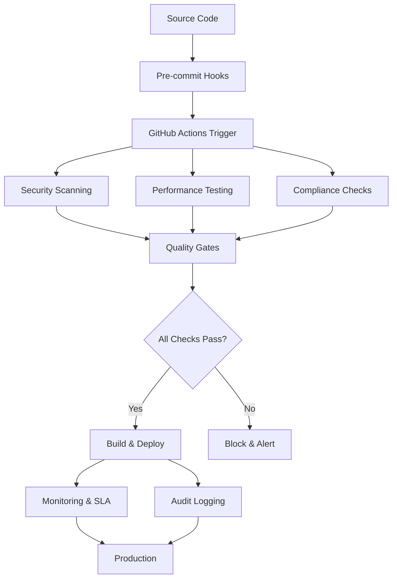

# Workflow Integration Guide

## Overview

This guide provides comprehensive instructions for integrating the advanced SDLC enhancements with existing CI/CD pipelines and workflows. The integration strategy focuses on seamless adoption while maintaining backward compatibility and providing immediate value.

## Table of Contents

1. [Integration Architecture](#integration-architecture)
2. [GitHub Actions Integration](#github-actions-integration)
3. [CI/CD Pipeline Enhancement](#cicd-pipeline-enhancement)
4. [Monitoring Stack Integration](#monitoring-stack-integration)
5. [Security Pipeline Integration](#security-pipeline-integration)
6. [Performance Testing Integration](#performance-testing-integration)
7. [Compliance and Audit Integration](#compliance-and-audit-integration)
8. [Configuration Management](#configuration-management)
9. [Troubleshooting and Maintenance](#troubleshooting-and-maintenance)
10. [Migration Procedures](#migration-procedures)

## Integration Architecture

### High-Level Integration Flow



### Integration Points

1. **Source Control Integration**: Pre-commit hooks and branch protection
2. **CI/CD Pipeline Integration**: Automated quality gates and deployment gates
3. **Monitoring Integration**: Real-time metrics and alerting
4. **Security Integration**: Continuous security scanning and vulnerability management
5. **Compliance Integration**: Automated audit trails and compliance reporting

## GitHub Actions Integration

### 1. Core Workflow Setup

Create the following directory structure in your repository:

```
.github/
├── workflows/
│   ├── security-scanning.yml
│   ├── performance-monitoring.yml
│   ├── compliance-automation.yml
│   ├── mlops-training.yml
│   └── blue-green-deploy.yml
├── ISSUE_TEMPLATE/
│   ├── bug_report.yml
│   ├── security_vulnerability.yml
│   └── performance_issue.yml
└── pull_request_template.md
```

### 2. Workflow Configuration Files

#### Main CI/CD Workflow Integration

Create `.github/workflows/enhanced-ci.yml`:

```yaml
name: Enhanced CI/CD Pipeline

on:
  push:
    branches: [main, develop]
  pull_request:
    branches: [main]

jobs:
  pre-checks:
    runs-on: ubuntu-latest
    outputs:
      should-run-full: ${{ steps.changes.outputs.should-run }}
    steps:
      - uses: actions/checkout@v4
      - name: Check for significant changes
        id: changes
        run: |
          # Logic to determine if full pipeline should run
          if [[ "${{ github.event_name }}" == "push" && "${{ github.ref }}" == "refs/heads/main" ]]; then
            echo "should-run=true" >> $GITHUB_OUTPUT
          elif [[ "${{ github.event_name }}" == "pull_request" ]]; then
            echo "should-run=true" >> $GITHUB_OUTPUT
          else
            echo "should-run=false" >> $GITHUB_OUTPUT
          fi

  security-gate:
    needs: pre-checks
    if: needs.pre-checks.outputs.should-run-full == 'true'
    uses: ./.github/workflows/security-scanning.yml
    secrets: inherit

  performance-gate:
    needs: pre-checks
    if: needs.pre-checks.outputs.should-run-full == 'true'
    uses: ./.github/workflows/performance-monitoring.yml
    secrets: inherit

  compliance-gate:
    needs: pre-checks
    if: needs.pre-checks.outputs.should-run-full == 'true'
    uses: ./.github/workflows/compliance-automation.yml
    secrets: inherit

  integration-tests:
    needs: [security-gate, performance-gate, compliance-gate]
    runs-on: ubuntu-latest
    steps:
      - uses: actions/checkout@v4
      - name: Setup Python
        uses: actions/setup-python@v4
        with:
          python-version: "3.11"
          cache: 'pip'
      
      - name: Install dependencies
        run: |
          pip install -r requirements.txt
          pip install -r requirements-dev.txt
          pip install -e .
      
      - name: Run integration tests
        run: |
          python -m pytest tests/integration/ -v --cov=src --cov-report=xml
      
      - name: Upload coverage
        uses: codecov/codecov-action@v3
        with:
          file: ./coverage.xml

  build-and-push:
    needs: integration-tests
    if: github.ref == 'refs/heads/main'
    runs-on: ubuntu-latest
    steps:
      - uses: actions/checkout@v4
      
      - name: Build Docker image
        run: |
          docker build -t ${{ secrets.DOCKER_REGISTRY }}/multimodal-contract-extractor:${{ github.sha }} .
          docker build -t ${{ secrets.DOCKER_REGISTRY }}/multimodal-contract-extractor:latest .
      
      - name: Security scan built image
        run: |
          docker run --rm -v /var/run/docker.sock:/var/run/docker.sock \
            aquasec/trivy image ${{ secrets.DOCKER_REGISTRY }}/multimodal-contract-extractor:${{ github.sha }}
      
      - name: Push to registry
        run: |
          echo ${{ secrets.DOCKER_REGISTRY_TOKEN }} | docker login -u ${{ secrets.DOCKER_REGISTRY_USER }} --password-stdin
          docker push ${{ secrets.DOCKER_REGISTRY }}/multimodal-contract-extractor:${{ github.sha }}
          docker push ${{ secrets.DOCKER_REGISTRY }}/multimodal-contract-extractor:latest

  post-deployment-monitoring:
    needs: build-and-push
    runs-on: ubuntu-latest
    steps:
      - name: Trigger monitoring setup
        run: |
          # Trigger SLA monitoring setup for new deployment
          curl -X POST "${{ secrets.MONITORING_WEBHOOK_URL }}" \
            -H "Content-Type: application/json" \
            -d '{
              "type": "deployment",
              "version": "${{ github.sha }}",
              "environment": "production",
              "monitoring_enabled": true
            }'
```

### 3. Reusable Workflow Components

Each enhancement component includes reusable workflow files that can be called from the main CI/CD pipeline:

- **Security Scanning**: Comprehensive security analysis
- **Performance Monitoring**: Automated benchmarking and regression detection
- **Compliance Automation**: Audit trail validation and compliance reporting
- **MLOps Training**: Model training and evaluation pipeline
- **Blue-Green Deployment**: Safe production deployment with rollback

## CI/CD Pipeline Enhancement

### 1. Quality Gates Integration

#### Security Quality Gate

```yaml
# Security quality gate configuration
security_quality_gate:
  enabled: true
  fail_on_critical: true
  fail_on_high: false  # Warning only for HIGH severity
  max_vulnerabilities:
    critical: 0
    high: 5
    medium: 20
  required_scans:
    - container_image
    - source_code
    - dependencies
    - secrets
```

#### Performance Quality Gate

```yaml
# Performance quality gate configuration
performance_quality_gate:
  enabled: true
  regression_threshold: 10  # 10% regression fails the build
  benchmarks:
    response_time:
      baseline: 1.0  # seconds
      threshold: 1.5  # seconds
    memory_usage:
      baseline: 500  # MB
      threshold: 750  # MB
    throughput:
      baseline: 100  # requests/minute
      threshold: 75   # requests/minute
```

#### Compliance Quality Gate

```yaml
# Compliance quality gate configuration
compliance_quality_gate:
  enabled: true
  required_checks:
    - audit_trail_integrity
    - license_compliance
    - data_privacy_compliance
    - security_policy_adherence
  fail_on_violation: true
  generate_reports: true
```

### 2. Pipeline Stage Integration

#### Enhanced Build Stage

```bash
#!/bin/bash
# Enhanced build stage with integrated checks

set -euo pipefail

echo "=== Enhanced Build Pipeline ==="

# 1. Pre-build security scan
echo "Running pre-build security scan..."
./scripts/security-scan.sh filesystem

# 2. Performance baseline check
echo "Checking performance baselines..."
./scripts/performance-test.sh baseline

# 3. Build application
echo "Building application..."
docker build -t app:${BUILD_NUMBER} .

# 4. Post-build security scan
echo "Running post-build security scan..."
./scripts/security-scan.sh image app:${BUILD_NUMBER}

# 5. Performance regression test
echo "Running performance regression tests..."
./scripts/performance-test.sh full

# 6. Compliance validation
echo "Running compliance checks..."
python governance/audit_automation.py --validate-build

echo "Build pipeline completed successfully!"
```

### 3. Deployment Integration

#### Pre-deployment Validation

```yaml
pre_deployment_validation:
  steps:
    - name: Validate SLA Configuration
      run: |
        python -c "
        from monitoring.sla_monitoring import get_sla_monitor
        monitor = get_sla_monitor()
        status = monitor.get_sla_status()
        print(f'SLA Status: {status[\"overall_status\"]}')
        assert status['overall_status'] != 'breached'
        "
    
    - name: Validate Audit System
      run: |
        python -c "
        from governance.audit_automation import get_audit_logger
        logger = get_audit_logger()
        integrity = logger.verify_integrity()
        print(f'Audit Integrity: {integrity[\"status\"]}')
        assert integrity['status'] == 'success'
        "
    
    - name: Security Readiness Check
      run: |
        ./scripts/security-scan.sh image ${{ env.DEPLOY_IMAGE }}
        if [ $? -ne 0 ]; then
          echo "Security scan failed - deployment blocked"
          exit 1
        fi
```

## Monitoring Stack Integration

### 1. Prometheus Configuration

Create `monitoring/prometheus-integration.yml`:

```yaml
# Prometheus configuration for SDLC monitoring
global:
  scrape_interval: 15s
  evaluation_interval: 15s

rule_files:
  - "alert_rules.yml"
  - "sla_rules.yml"

scrape_configs:
  - job_name: 'application'
    static_configs:
      - targets: ['localhost:8000']
    metrics_path: '/metrics'
    scrape_interval: 10s

  - job_name: 'sla-monitor'
    static_configs:
      - targets: ['localhost:8001']
    metrics_path: '/sla/metrics'

  - job_name: 'security-scanner'
    static_configs:
      - targets: ['localhost:8002']
    metrics_path: '/security/metrics'

  - job_name: 'performance-monitor'
    static_configs:
      - targets: ['localhost:8003']
    metrics_path: '/performance/metrics'

alerting:
  alertmanagers:
    - static_configs:
        - targets:
          - alertmanager:9093
```

### 2. Grafana Dashboard Configuration

Create monitoring dashboards:

```json
{
  "dashboard": {
    "title": "SDLC Enhancement Dashboard",
    "panels": [
      {
        "title": "Security Status",
        "type": "stat",
        "targets": [
          {
            "expr": "security_vulnerabilities_total",
            "legendFormat": "Vulnerabilities"
          }
        ]
      },
      {
        "title": "Performance Metrics",
        "type": "graph",
        "targets": [
          {
            "expr": "rate(http_requests_total[5m])",
            "legendFormat": "Request Rate"
          },
          {
            "expr": "histogram_quantile(0.95, rate(http_request_duration_seconds_bucket[5m]))",
            "legendFormat": "95th Percentile Latency"
          }
        ]
      },
      {
        "title": "SLA Compliance",
        "type": "gauge",
        "targets": [
          {
            "expr": "sla_compliance_percentage",
            "legendFormat": "SLA Compliance"
          }
        ]
      },
      {
        "title": "Audit Events",
        "type": "logs",
        "targets": [
          {
            "expr": "{job=\"audit-logger\"}",
            "legendFormat": ""
          }
        ]
      }
    ]
  }
}
```

### 3. Alert Rules Configuration

Create `monitoring/alert_rules.yml`:

```yaml
groups:
  - name: security_alerts
    rules:
      - alert: CriticalVulnerabilityDetected
        expr: security_vulnerabilities{severity="CRITICAL"} > 0
        for: 0m
        labels:
          severity: critical
        annotations:
          summary: "Critical security vulnerability detected"
          description: "{{ $value }} critical vulnerabilities found in {{ $labels.component }}"

  - name: performance_alerts
    rules:
      - alert: PerformanceRegression
        expr: performance_regression_percentage > 10
        for: 2m
        labels:
          severity: warning
        annotations:
          summary: "Performance regression detected"
          description: "Performance degraded by {{ $value }}% in {{ $labels.test_name }}"

  - name: sla_alerts
    rules:
      - alert: SLAViolation
        expr: sla_status != 0
        for: 1m
        labels:
          severity: critical
        annotations:
          summary: "SLA violation detected"
          description: "SLA {{ $labels.sla_name }} is in violation: {{ $labels.status }}"

  - name: audit_alerts
    rules:
      - alert: AuditIntegrityFailure
        expr: audit_integrity_status != 1
        for: 0m
        labels:
          severity: critical
        annotations:
          summary: "Audit log integrity failure"
          description: "Audit log integrity check failed: {{ $labels.reason }}"
```

## Security Pipeline Integration

### 1. Multi-Stage Security Scanning

```yaml
# Security pipeline stages
security_pipeline:
  stages:
    - name: "Source Code Analysis"
      tools:
        - bandit
        - semgrep
        - sonarqube
      
    - name: "Dependency Scanning"
      tools:
        - safety
        - pip-audit
        - npm-audit
      
    - name: "Container Security"
      tools:
        - trivy
        - grype
        - docker-bench
      
    - name: "Infrastructure Security"
      tools:
        - terraform-security
        - kubernetes-security
        - cloud-security
```

### 2. Security Automation Integration

Create `.github/workflows/security-integration.yml`:

```yaml
name: Security Integration Pipeline

on:
  push:
    branches: [main, develop]
  pull_request:
    branches: [main]
  schedule:
    - cron: '0 2 * * *'  # Daily at 2 AM

jobs:
  security-scan:
    runs-on: ubuntu-latest
    steps:
      - uses: actions/checkout@v4
      
      - name: Setup environment
        run: |
          pip install -r requirements.txt
          pip install -r requirements-dev.txt
      
      - name: Run comprehensive security scan
        run: |
          # Create reports directory
          mkdir -p security-reports
          
          # Run all security scans
          ./scripts/security-scan.sh > security-reports/scan-summary.txt
          
          # Upload results to security dashboard
          python scripts/upload-security-results.py security-reports/
      
      - name: Upload security artifacts
        uses: actions/upload-artifact@v3
        with:
          name: security-reports
          path: security-reports/
      
      - name: Update security dashboard
        run: |
          # Update centralized security dashboard
          curl -X POST "${{ secrets.SECURITY_DASHBOARD_URL }}" \
            -H "Authorization: Bearer ${{ secrets.SECURITY_TOKEN }}" \
            -H "Content-Type: application/json" \
            -d @security-reports/scan-summary.json
```

## Performance Testing Integration

### 1. Continuous Performance Monitoring

Create performance monitoring integration:

```python
# performance_integration.py
"""Performance testing integration for CI/CD pipeline."""

import json
import sys
from pathlib import Path
from performance.benchmarks import run_benchmarks
from performance.load_testing import run_load_tests

def integrate_performance_testing():
    """Run performance tests and integrate with CI/CD."""
    
    results = {
        'benchmark_results': run_benchmarks(),
        'load_test_results': run_load_tests(),
        'timestamp': datetime.now().isoformat()
    }
    
    # Save results
    results_dir = Path('performance/results')
    results_dir.mkdir(exist_ok=True, parents=True)
    
    with open(results_dir / 'ci_results.json', 'w') as f:
        json.dump(results, f, indent=2)
    
    # Check for regressions
    if check_performance_regression(results):
        print("Performance regression detected!")
        sys.exit(1)
    
    print("Performance tests passed!")
    return results

def check_performance_regression(results):
    """Check for performance regressions."""
    baseline_file = Path('performance/baseline.json')
    
    if not baseline_file.exists():
        print("No baseline found - creating baseline")
        with open(baseline_file, 'w') as f:
            json.dump(results, f, indent=2)
        return False
    
    with open(baseline_file) as f:
        baseline = json.load(f)
    
    # Compare key metrics
    regression_threshold = 0.1  # 10%
    
    for test_name, current_metrics in results['benchmark_results'].items():
        if test_name in baseline['benchmark_results']:
            baseline_time = baseline['benchmark_results'][test_name]['avg_execution_time']
            current_time = current_metrics['avg_execution_time']
            
            regression = (current_time - baseline_time) / baseline_time
            
            if regression > regression_threshold:
                print(f"Regression detected in {test_name}: {regression:.1%}")
                return True
    
    return False

if __name__ == "__main__":
    integrate_performance_testing()
```

### 2. Performance Gate Configuration

```yaml
# Performance gate in CI/CD
performance_gate:
  runs-on: ubuntu-latest
  steps:
    - uses: actions/checkout@v4
    
    - name: Setup performance testing
      run: |
        pip install -r requirements.txt
        pip install -r requirements-dev.txt
    
    - name: Run performance tests
      run: |
        python performance_integration.py
    
    - name: Archive performance results
      uses: actions/upload-artifact@v3
      with:
        name: performance-results
        path: performance/results/
    
    - name: Comment PR with performance results
      if: github.event_name == 'pull_request'
      uses: actions/github-script@v6
      with:
        script: |
          const fs = require('fs');
          const results = JSON.parse(fs.readFileSync('performance/results/ci_results.json'));
          
          const comment = `## 🚀 Performance Test Results
          
          ### Benchmark Results
          ${Object.entries(results.benchmark_results).map(([name, metrics]) => 
            `- **${name}**: ${metrics.avg_execution_time.toFixed(3)}s avg`
          ).join('\n')}
          
          ### Load Test Results
          - **Requests/sec**: ${results.load_test_results.requests_per_second}
          - **Average Response Time**: ${results.load_test_results.avg_response_time}ms
          - **Error Rate**: ${results.load_test_results.error_rate}%
          `;
          
          github.rest.issues.createComment({
            issue_number: context.issue.number,
            owner: context.repo.owner,
            repo: context.repo.repo,
            body: comment
          });
```

## Compliance and Audit Integration

### 1. Automated Compliance Checking

Create `scripts/compliance-integration.sh`:

```bash
#!/bin/bash
# Compliance integration script for CI/CD

set -euo pipefail

echo "=== Compliance Integration Check ==="

# Initialize compliance check
COMPLIANCE_PASSED=true
COMPLIANCE_REPORT="compliance-report.json"

# 1. Audit trail integrity
echo "Checking audit trail integrity..."
python -c "
from governance.audit_automation import get_audit_logger
logger = get_audit_logger()
result = logger.verify_integrity()
print(f'Integrity Status: {result[\"status\"]}')
exit(0 if result['status'] == 'success' else 1)
" || COMPLIANCE_PASSED=false

# 2. License compliance
echo "Checking license compliance..."
pip-licenses --format=json --output-file=licenses.json
python scripts/check_license_compliance.py || COMPLIANCE_PASSED=false

# 3. Security compliance
echo "Checking security compliance..."
./scripts/security-scan.sh filesystem || COMPLIANCE_PASSED=false

# 4. Data privacy compliance
echo "Checking data privacy compliance..."
python scripts/privacy_compliance_check.py || COMPLIANCE_PASSED=false

# 5. Generate compliance report
echo "Generating compliance report..."
python -c "
import json
from datetime import datetime
from governance.audit_automation import get_audit_logger

logger = get_audit_logger()
report = logger.generate_compliance_report(
    start_date=datetime.now() - timedelta(days=1),
    end_date=datetime.now()
)

with open('$COMPLIANCE_REPORT', 'w') as f:
    json.dump(report, f, indent=2)

print(f'Compliance report generated: $COMPLIANCE_REPORT')
"

# Check overall compliance status
if [ "$COMPLIANCE_PASSED" = true ]; then
    echo "✅ All compliance checks passed"
    exit 0
else
    echo "❌ Compliance violations detected"
    exit 1
fi
```

### 2. Continuous Compliance Monitoring

```yaml
# Continuous compliance monitoring workflow
name: Compliance Monitoring

on:
  schedule:
    - cron: '0 1 * * *'  # Daily at 1 AM
  workflow_dispatch:

jobs:
  compliance-check:
    runs-on: ubuntu-latest
    steps:
      - uses: actions/checkout@v4
      
      - name: Setup environment
        run: |
          pip install -r requirements.txt
          pip install -r requirements-dev.txt
      
      - name: Run compliance checks
        run: |
          ./scripts/compliance-integration.sh
      
      - name: Upload compliance report
        uses: actions/upload-artifact@v3
        with:
          name: compliance-report
          path: compliance-report.json
      
      - name: Send compliance notification
        if: failure()
        run: |
          curl -X POST "${{ secrets.COMPLIANCE_WEBHOOK_URL }}" \
            -H "Content-Type: application/json" \
            -d '{
              "type": "compliance_violation",
              "repository": "${{ github.repository }}",
              "timestamp": "'$(date -Iseconds)'",
              "details": "Compliance check failed in scheduled run"
            }'
```

## Configuration Management

### 1. Environment-Specific Configuration

Create configuration files for different environments:

```yaml
# config/development.yml
environment: development
security:
  scan_enabled: true
  severity_threshold: MEDIUM
  fail_on_high: false
performance:
  benchmarks_enabled: true
  regression_threshold: 0.2  # 20% for dev
monitoring:
  sla_enabled: false
  metrics_retention_days: 7
audit:
  enabled: true
  retention_days: 30

---
# config/staging.yml
environment: staging
security:
  scan_enabled: true
  severity_threshold: HIGH
  fail_on_high: true
performance:
  benchmarks_enabled: true
  regression_threshold: 0.15  # 15% for staging
monitoring:
  sla_enabled: true
  metrics_retention_days: 30
audit:
  enabled: true
  retention_days: 90

---
# config/production.yml
environment: production
security:
  scan_enabled: true
  severity_threshold: CRITICAL
  fail_on_high: true
performance:
  benchmarks_enabled: true
  regression_threshold: 0.05  # 5% for production
monitoring:
  sla_enabled: true
  metrics_retention_days: 90
audit:
  enabled: true
  retention_days: 2555  # 7 years
```

### 2. Dynamic Configuration Loading

```python
# config/config_manager.py
"""Dynamic configuration management for SDLC enhancements."""

import os
import yaml
from pathlib import Path
from typing import Dict, Any

class ConfigManager:
    """Manages configuration for different environments."""
    
    def __init__(self, environment: str = None):
        self.environment = environment or os.getenv('ENVIRONMENT', 'development')
        self.config_dir = Path(__file__).parent
        self.config = self._load_config()
    
    def _load_config(self) -> Dict[str, Any]:
        """Load configuration for current environment."""
        config_file = self.config_dir / f"{self.environment}.yml"
        
        if not config_file.exists():
            config_file = self.config_dir / "development.yml"
        
        with open(config_file) as f:
            config = yaml.safe_load(f)
        
        # Override with environment variables
        self._apply_env_overrides(config)
        
        return config
    
    def _apply_env_overrides(self, config: Dict[str, Any]) -> None:
        """Apply environment variable overrides."""
        env_mappings = {
            'SECURITY_SEVERITY_THRESHOLD': ['security', 'severity_threshold'],
            'PERFORMANCE_REGRESSION_THRESHOLD': ['performance', 'regression_threshold'],
            'SLA_ENABLED': ['monitoring', 'sla_enabled'],
            'AUDIT_RETENTION_DAYS': ['audit', 'retention_days']
        }
        
        for env_var, config_path in env_mappings.items():
            if env_var in os.environ:
                self._set_nested_value(config, config_path, os.getenv(env_var))
    
    def _set_nested_value(self, config: Dict, path: list, value: str) -> None:
        """Set nested configuration value."""
        current = config
        for key in path[:-1]:
            current = current.setdefault(key, {})
        
        # Convert value to appropriate type
        if value.lower() in ('true', 'false'):
            value = value.lower() == 'true'
        elif value.isdigit():
            value = int(value)
        elif value.replace('.', '').isdigit():
            value = float(value)
        
        current[path[-1]] = value
    
    def get(self, key: str, default: Any = None) -> Any:
        """Get configuration value."""
        keys = key.split('.')
        current = self.config
        
        for k in keys:
            if isinstance(current, dict) and k in current:
                current = current[k]
            else:
                return default
        
        return current
    
    def get_security_config(self) -> Dict[str, Any]:
        """Get security configuration."""
        return self.config.get('security', {})
    
    def get_performance_config(self) -> Dict[str, Any]:
        """Get performance configuration."""
        return self.config.get('performance', {})
    
    def get_monitoring_config(self) -> Dict[str, Any]:
        """Get monitoring configuration."""
        return self.config.get('monitoring', {})
    
    def get_audit_config(self) -> Dict[str, Any]:
        """Get audit configuration."""
        return self.config.get('audit', {})

# Global configuration instance
_config_manager = None

def get_config(environment: str = None) -> ConfigManager:
    """Get global configuration manager."""
    global _config_manager
    
    if _config_manager is None or (environment and _config_manager.environment != environment):
        _config_manager = ConfigManager(environment)
    
    return _config_manager
```

## Troubleshooting and Maintenance

### 1. Common Integration Issues

#### Issue: Security scans failing in CI/CD

**Solution:**
```bash
# Check Trivy installation and configuration
trivy --version
trivy image --help

# Verify Trivy configuration
cat trivy.yaml

# Test security scan locally
./scripts/security-scan.sh filesystem
```

#### Issue: Performance tests timing out

**Solution:**
```bash
# Increase timeout in CI/CD configuration
export PERFORMANCE_TIMEOUT=600  # 10 minutes

# Run performance tests with verbose output
./scripts/performance-test.sh full --verbose

# Check system resources
df -h
free -m
```

#### Issue: SLA monitoring not working

**Solution:**
```python
# Test SLA monitor initialization
from monitoring.sla_monitoring import get_sla_monitor
monitor = get_sla_monitor()
status = monitor.get_sla_status()
print(f"SLA Status: {status}")

# Check SLA configuration
monitor = get_sla_monitor()
for name, target in monitor.slo_targets.items():
    print(f"{name}: {target.to_dict()}")
```

### 2. Maintenance Scripts

Create `scripts/maintenance.sh`:

```bash
#!/bin/bash
# Maintenance script for SDLC enhancements

set -euo pipefail

COMMAND=${1:-help}

case $COMMAND in
    "cleanup")
        echo "Cleaning up old artifacts..."
        find . -name "*.pyc" -delete
        find . -name "__pycache__" -type d -exec rm -rf {} + 2>/dev/null || true
        find performance/results -name "*.json" -mtime +30 -delete
        find security-reports -name "*.json" -mtime +7 -delete
        ;;
    
    "health-check")
        echo "Running system health check..."
        python -c "
from monitoring.sla_monitoring import get_sla_monitor
from governance.audit_automation import get_audit_logger

# Check SLA monitor
try:
    monitor = get_sla_monitor()
    status = monitor.get_sla_status()
    print(f'SLA Monitor: OK - Status: {status[\"overall_status\"]}')
except Exception as e:
    print(f'SLA Monitor: ERROR - {e}')

# Check audit logger
try:
    logger = get_audit_logger()
    integrity = logger.verify_integrity()
    print(f'Audit Logger: OK - Integrity: {integrity[\"status\"]}')
except Exception as e:
    print(f'Audit Logger: ERROR - {e}')
"
        ;;
    
    "update-baselines")
        echo "Updating performance baselines..."
        ./scripts/performance-test.sh baseline
        echo "Baselines updated successfully"
        ;;
    
    "rotate-logs")
        echo "Rotating log files..."
        find governance/audit_logs -name "*.jsonl" -size +10M -exec gzip {} \;
        find monitoring/sla -name "*.log" -mtime +7 -delete
        ;;
    
    "backup")
        echo "Creating backup of critical data..."
        BACKUP_DIR="backups/$(date +%Y%m%d_%H%M%S)"
        mkdir -p "$BACKUP_DIR"
        
        cp -r governance/audit_logs "$BACKUP_DIR/"
        cp -r monitoring/sla "$BACKUP_DIR/"
        cp -r performance/results "$BACKUP_DIR/"
        
        tar -czf "$BACKUP_DIR.tar.gz" "$BACKUP_DIR"
        rm -rf "$BACKUP_DIR"
        
        echo "Backup created: $BACKUP_DIR.tar.gz"
        ;;
    
    "help"|*)
        echo "SDLC Enhancement Maintenance Script"
        echo ""
        echo "Usage: $0 <command>"
        echo ""
        echo "Commands:"
        echo "  cleanup        - Clean up temporary files and old artifacts"
        echo "  health-check   - Run system health check"
        echo "  update-baselines - Update performance baselines"
        echo "  rotate-logs    - Rotate and compress log files"
        echo "  backup         - Create backup of critical data"
        echo "  help           - Show this help message"
        ;;
esac
```

## Migration Procedures

### 1. Gradual Migration Strategy

#### Phase 1: Foundation Setup (Week 1)
```bash
# 1. Install base dependencies
pip install -r requirements-dev.txt

# 2. Initialize monitoring components
python -c "
from monitoring.sla_monitoring import get_sla_monitor
from governance.audit_automation import get_audit_logger

monitor = get_sla_monitor()
logger = get_audit_logger()

print('✅ Monitoring components initialized')
"

# 3. Set up basic security scanning
./scripts/security-scan.sh filesystem
```

#### Phase 2: CI/CD Integration (Week 2)
```bash
# 1. Create GitHub Actions workflows
mkdir -p .github/workflows
cp docs/workflows/advanced-workflows.md .github/workflows/

# 2. Configure repository secrets
# (Manual step - add secrets via GitHub UI)

# 3. Test workflows
git add .github/workflows/
git commit -m "Add SDLC enhancement workflows"
git push
```

#### Phase 3: Full Integration (Week 3)
```bash
# 1. Enable all monitoring
export SLA_ALERTS_ENABLED=true
export AUDIT_INTEGRITY_CHECKS=true

# 2. Configure external integrations
# (Configure webhooks, monitoring dashboards, etc.)

# 3. Run comprehensive validation
./scripts/maintenance.sh health-check
```

### 2. Rollback Procedures

#### Emergency Rollback Script

Create `scripts/rollback.sh`:

```bash
#!/bin/bash
# Emergency rollback script

set -euo pipefail

ROLLBACK_TYPE=${1:-partial}

case $ROLLBACK_TYPE in
    "workflows")
        echo "Rolling back GitHub Actions workflows..."
        git rm -r .github/workflows/security-scanning.yml || true
        git rm -r .github/workflows/performance-monitoring.yml || true
        git rm -r .github/workflows/compliance-automation.yml || true
        git commit -m "Rollback: Remove SDLC enhancement workflows"
        ;;
    
    "monitoring")
        echo "Disabling monitoring components..."
        export SLA_ALERTS_ENABLED=false
        export AUDIT_INTEGRITY_CHECKS=false
        
        # Stop monitoring processes
        pkill -f "sla_monitor" || true
        pkill -f "audit_logger" || true
        ;;
    
    "full")
        echo "Full rollback of SDLC enhancements..."
        
        # Disable all features
        export SLA_ALERTS_ENABLED=false
        export AUDIT_INTEGRITY_CHECKS=false
        export SECURITY_SCAN_ENABLED=false
        export PERFORMANCE_MONITORING_ENABLED=false
        
        # Remove workflows
        git rm -r .github/workflows/security-scanning.yml || true
        git rm -r .github/workflows/performance-monitoring.yml || true
        git rm -r .github/workflows/compliance-automation.yml || true
        
        # Restore original CI configuration
        git checkout HEAD~10 -- .github/workflows/ci.yml || true
        
        git commit -m "Emergency rollback: Disable all SDLC enhancements"
        ;;
    
    *)
        echo "Usage: $0 [workflows|monitoring|full]"
        exit 1
        ;;
esac

echo "Rollback completed: $ROLLBACK_TYPE"
```

### 3. Migration Validation

Create `scripts/validate-migration.sh`:

```bash
#!/bin/bash
# Migration validation script

set -euo pipefail

echo "=== SDLC Enhancement Migration Validation ==="

VALIDATION_PASSED=true

# 1. Check security scanning
echo "Validating security scanning..."
if ./scripts/security-scan.sh filesystem > /dev/null 2>&1; then
    echo "✅ Security scanning: OK"
else
    echo "❌ Security scanning: FAILED"
    VALIDATION_PASSED=false
fi

# 2. Check performance monitoring
echo "Validating performance monitoring..."
if ./scripts/performance-test.sh benchmark > /dev/null 2>&1; then
    echo "✅ Performance monitoring: OK"
else
    echo "❌ Performance monitoring: FAILED"
    VALIDATION_PASSED=false
fi

# 3. Check SLA monitoring
echo "Validating SLA monitoring..."
python -c "
try:
    from monitoring.sla_monitoring import get_sla_monitor
    monitor = get_sla_monitor()
    status = monitor.get_sla_status()
    print('✅ SLA monitoring: OK')
except Exception as e:
    print(f'❌ SLA monitoring: FAILED - {e}')
    exit(1)
" || VALIDATION_PASSED=false

# 4. Check audit logging
echo "Validating audit logging..."
python -c "
try:
    from governance.audit_automation import get_audit_logger
    logger = get_audit_logger()
    integrity = logger.verify_integrity()
    print('✅ Audit logging: OK')
except Exception as e:
    print(f'❌ Audit logging: FAILED - {e}')
    exit(1)
" || VALIDATION_PASSED=false

# 5. Check GitHub Actions workflows
echo "Validating GitHub Actions workflows..."
if [ -f ".github/workflows/security-scanning.yml" ] && 
   [ -f ".github/workflows/performance-monitoring.yml" ] && 
   [ -f ".github/workflows/compliance-automation.yml" ]; then
    echo "✅ GitHub Actions workflows: OK"
else
    echo "❌ GitHub Actions workflows: MISSING"
    VALIDATION_PASSED=false
fi

# Final validation result
echo ""
if [ "$VALIDATION_PASSED" = true ]; then
    echo "🎉 Migration validation: SUCCESS"
    echo "All SDLC enhancements are working correctly!"
    exit 0
else
    echo "💥 Migration validation: FAILED"
    echo "Some components are not working correctly. Please check the logs above."
    exit 1
fi
```

This comprehensive workflow integration guide provides all the necessary components, scripts, and procedures to successfully integrate the SDLC enhancements with existing development workflows while maintaining reliability and providing clear rollback paths.