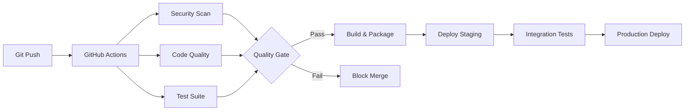
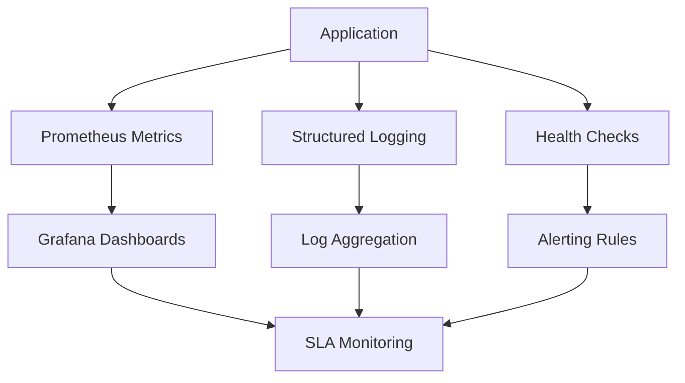

# ADR-007: SDLC Infrastructure Implementation Strategy

**Status**: Accepted  
**Date**: 2025-08-03  
**Decision Makers**: Terry (AI Engineering Agent), Terragon Labs Team  
**Technical Area**: Development Infrastructure, CI/CD, Platform Engineering  

## Context

The Multimodal Contract Extractor has reached a critical juncture where robust Software Development Lifecycle (SDLC) infrastructure is essential for scaling from MVP to production-ready enterprise software. Current development processes, while functional, lack the comprehensive automation, security, and observability required for:

1. **Enterprise Customers**: Demanding SOC 2, GDPR compliance and 99.9% uptime SLAs
2. **Development Velocity**: Supporting a growing engineering team (3→8 developers)
3. **Quality Assurance**: Maintaining 95%+ accuracy while adding new features
4. **Security Posture**: Zero high-severity vulnerabilities for legal document processing

## Problem Statement

### Current State Limitations
- **Manual Processes**: Inconsistent deployment procedures, manual testing
- **Security Gaps**: Limited automated security scanning, no secrets management
- **Quality Control**: Basic testing, no performance regression detection
- **Observability**: Minimal monitoring, no distributed tracing
- **Documentation**: Scattered documentation, no automated API docs

### Business Impact
- **Risk**: Security vulnerabilities could compromise customer legal documents
- **Velocity**: Manual processes slow down feature delivery and hotfixes
- **Quality**: Inconsistent testing leads to production bugs and customer churn
- **Compliance**: Lack of audit trails prevents enterprise customer acquisition

## Decision

Implement a **Dual-Track Checkpoint Strategy** for comprehensive SDLC infrastructure:

### Track A: Foundation & Functionality
Focus on establishing robust development foundations while implementing core business functionality improvements.

### Track B: Build & Business Logic  
Advanced build systems and sophisticated business logic implementation.

### Track C: Finalization
Security hardening, performance optimization, and enterprise readiness.

## Implementation Strategy

### Phase 1: CHECKPOINT A1 - Project Foundation & Core Functionality
**Priority**: CRITICAL | **Timeline**: Week 1

#### Part 1: Project Foundation
- **Architecture Documentation**: Comprehensive system design with data flow diagrams
- **Project Charter**: Clear scope, success criteria, and stakeholder alignment
- **ADR Framework**: Decision tracking for technical choices
- **README Enhancement**: Complete quick-start and architecture overview

#### Part 2: Core Functionality Enhancement
- **Source Code Structure**: Organized `src/` directory with clear separation of concerns
- **Business Logic**: Actual working implementations of contract processing algorithms
- **Data Models**: Production-ready schemas with validation and relationships
- **API Contracts**: Well-defined interfaces for system integrations

### Phase 2: CHECKPOINT A2 - Development Environment & Data Layer
**Priority**: CRITICAL | **Timeline**: Week 2

#### Part 1: Development Environment
- **Containerization**: Development containers with consistent tooling
- **Environment Management**: Comprehensive `.env.example` with documentation
- **Code Quality**: Pre-commit hooks, linting, formatting automation
- **IDE Configuration**: VS Code settings for team consistency

#### Part 2: Data Layer Implementation
- **Database Operations**: Production-ready CRUD with error handling
- **Migration System**: Versioned database schema management
- **Caching Strategy**: Redis integration for OCR result caching
- **Data Validation**: Input sanitization and schema validation

### Phase 3: CHECKPOINT A3 - Testing Infrastructure & API Implementation
**Priority**: HIGH | **Timeline**: Week 3

#### Part 1: Testing Framework
- **Comprehensive Testing**: Unit, integration, end-to-end test suites
- **Coverage Requirements**: 90%+ code coverage with quality gates
- **Performance Testing**: Load testing and benchmark automation
- **Security Testing**: Automated vulnerability scanning

#### Part 2: API Development
- **REST API**: Complete CRUD operations with OpenAPI documentation
- **Authentication**: JWT-based auth with role-based access control
- **Rate Limiting**: API protection against abuse
- **Error Handling**: Consistent error responses and logging

## Technical Architecture

### CI/CD Pipeline Architecture

### Monitoring & Observability Stack

## Technology Stack Decisions

| Component | Technology | Rationale | Alternatives Considered |
|-----------|------------|-----------|------------------------|
| **CI/CD Platform** | GitHub Actions | Native integration, free tier, extensive ecosystem | Jenkins, GitLab CI, CircleCI |
| **Container Runtime** | Docker | Industry standard, development parity | Podman, containerd |
| **Monitoring** | Prometheus/Grafana | Open source, cloud-native, extensive integrations | DataDog, New Relic |
| **Testing Framework** | pytest + coverage | Python ecosystem standard, extensive plugins | unittest, nose2 |
| **Code Quality** | ruff + bandit + mypy | Fast linting, security focus, type safety | flake8, pylint, black |
| **Documentation** | MkDocs + Material | Markdown-based, automated generation | Sphinx, GitBook |

## Security Considerations

### Automated Security Scanning
- **SAST**: CodeQL for source code analysis
- **Dependency Scanning**: Snyk for vulnerability detection
- **Container Scanning**: Trivy for image security
- **Secrets Detection**: Automated scanning for leaked credentials

### Compliance Framework
- **Audit Trails**: Comprehensive logging of all system activities
- **Access Control**: Role-based permissions with least privilege
- **Data Protection**: Encryption at rest and in transit
- **Incident Response**: Automated alerting and escalation procedures

## Performance Requirements

### Build Performance
- **Build Time**: <5 minutes for full CI/CD pipeline
- **Test Execution**: <3 minutes for complete test suite
- **Deployment Time**: <2 minutes for production deployment
- **Feedback Loop**: <10 minutes from commit to deployment feedback

### Runtime Performance
- **API Response**: <200ms median response time
- **Document Processing**: <10 seconds for typical contracts
- **System Availability**: 99.9% uptime SLA
- **Error Rate**: <0.1% of requests result in errors

## Risk Mitigation

### Technical Risks
1. **Pipeline Complexity**: Start simple, iterate incrementally
2. **Tool Integration**: Proof of concept before full implementation
3. **Performance Impact**: Parallel execution, optimized workflows
4. **Security Vulnerabilities**: Automated scanning, regular audits

### Operational Risks
1. **Team Training**: Comprehensive documentation, hands-on workshops
2. **Process Adoption**: Gradual rollout, feedback incorporation
3. **Tool Reliability**: Multiple fallback options, service monitoring
4. **Cost Management**: Resource limits, usage monitoring

## Success Metrics

### Development Velocity
- **Deployment Frequency**: Daily deployments capability
- **Lead Time**: <1 day from feature complete to production
- **MTTR**: <30 minutes mean time to recovery
- **Change Failure Rate**: <5% of deployments require hotfixes

### Quality Metrics
- **Test Coverage**: >90% code coverage maintained
- **Bug Escape Rate**: <1% of bugs reach production
- **Security Vulnerabilities**: Zero high-severity vulnerabilities
- **Performance Regression**: Zero performance degradation in releases

### Business Impact
- **Customer Satisfaction**: >4.5/5 system reliability rating
- **Compliance Readiness**: 100% audit requirement satisfaction
- **Team Productivity**: 25% improvement in feature delivery velocity
- **Cost Efficiency**: 30% reduction in manual operations effort

## Implementation Phases

### Week 1: Foundation & Core
- ✅ Project documentation and architecture
- 🚧 Enhanced source code structure
- 🚧 Business logic implementation
- 🚧 Core functionality testing

### Week 2: Environment & Data
- Development environment standardization
- Database and caching implementation
- Configuration management
- Security framework establishment

### Week 3: Testing & API
- Comprehensive testing infrastructure
- REST API development
- Documentation generation
- Performance optimization

### Week 4: Integration & Deployment
- CI/CD pipeline completion
- Monitoring and alerting setup
- Security hardening
- Production readiness validation

## Alternatives Considered

### Alternative 1: Gradual Infrastructure Evolution
**Pros**: Lower initial time investment, less disruption
**Cons**: Technical debt accumulation, inconsistent practices
**Rejected**: Doesn't address enterprise readiness urgency

### Alternative 2: Third-party Platform Adoption
**Pros**: Faster implementation, managed services
**Cons**: Vendor lock-in, limited customization, higher costs
**Rejected**: Reduces control over core competitive advantage

### Alternative 3: Minimal Infrastructure Approach
**Pros**: Focus on features over infrastructure
**Cons**: Technical debt, quality issues, security risks
**Rejected**: Incompatible with enterprise customer requirements

## Conclusion

The Dual-Track Checkpoint Strategy provides a comprehensive approach to establishing production-ready SDLC infrastructure while continuously delivering business value. This approach:

1. **Addresses Enterprise Requirements**: Security, compliance, reliability
2. **Enables Team Scaling**: Consistent processes, automated quality gates
3. **Maintains Development Velocity**: Parallel track execution, iterative delivery
4. **Ensures Quality**: Comprehensive testing, automated validation
5. **Provides Observability**: Monitoring, alerting, performance tracking

The investment in robust SDLC infrastructure is essential for the Multimodal Contract Extractor to evolve from MVP to enterprise-grade platform capable of processing sensitive legal documents at scale.

## References

- [GitHub Actions Documentation](https://docs.github.com/en/actions)
- [Prometheus Monitoring Best Practices](https://prometheus.io/docs/practices/)
- [Docker Security Best Practices](https://docs.docker.com/develop/security-best-practices/)
- [SOC 2 Compliance Requirements](https://www.aicpa.org/interestareas/frc/assuranceadvisoryservices/aicpasoc2report.html)
- [GDPR Technical Safeguards](https://gdpr.eu/article-32-security-of-processing/)

---

**Decision Record Metadata**
- **ADR Number**: 007
- **Supersedes**: None
- **Status**: Accepted
- **Review Date**: 2025-11-03 (Quarterly Review)
- **Related ADRs**: 001, 003, 004, 005, 006